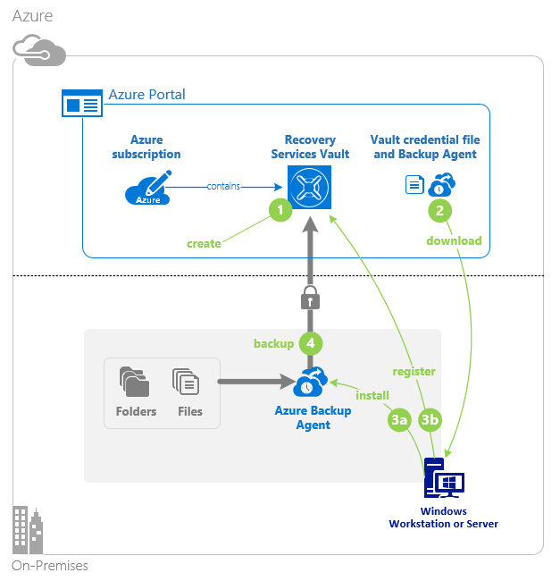
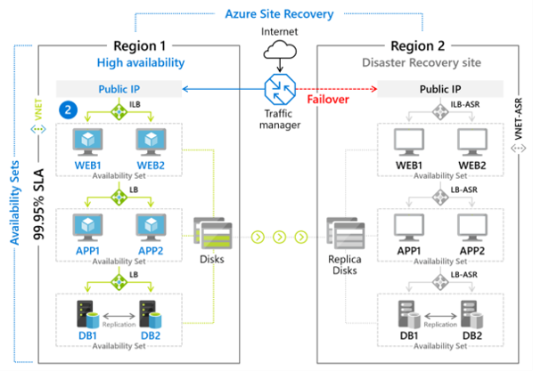
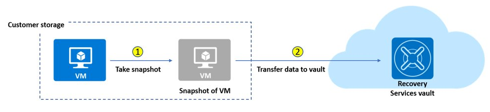

- [Azure Backup](#azure-backup)
  - [Backup center](#backup-center)
  - [Recovery Services Vault](#recovery-services-vault)
    - [On-premises file and folder backups](#on-premises-file-and-folder-backups)
    - [Recovery services vault backup options](#recovery-services-vault-backup-options)
  - [Virtual Machine backups](#virtual-machine-backups)
    - [VM Azure Backup](#vm-azure-backup)
    - [VM Azure Site Recovery](#vm-azure-site-recovery)
      - [Replication scenarios](#replication-scenarios)
      - [Features](#features)
    - [VM Snapshots](#vm-snapshots)
  - [Implement Azure Backup Server](#implement-azure-backup-server)
    - [Advantages](#advantages)
    - [backup steps](#backup-steps)
  - [Compare Azure Backup Agent (MARS) vs Azure Backup up server(MABS)](#compare-azure-backup-agent-mars-vs-azure-backup-up-servermabs)
  - [Manage soft delete](#manage-soft-delete)

# Azure Backup

Azure Backup is the Azure-based service you can use to back up (or protect) and restore your data in the Microsoft cloud.

Azure Backup offerst multiple components that you download and deploy on the appropriate computer, server, or in the cloud.  All Azure Backup components can be used to back up data to a Recovery Services vault in Azure.

**Key Benefits** [Details here](https://docs.microsoft.com/en-us/learn/modules/configure-file-folder-backups/2-describe-azure-backup-benefits)

## Backup center

Backup Center provides a single unified management experience in Azure for entrerprises to govern, monitor, operate, and analyze bckups at scale.

Currently supported for Azure VM Backup, SQL in Azure VM backup, SAP HANA in Azure VM backup, Azure Files backup, Azure Blobs backup, Azure-managed disks backup, and Azure for PostgreSQL Server backup.

## Recovery Services Vault

The Recovery Services vault is a storage entity in Azure that stores data.

You can create up to 25 Recovery Services vaults per region

### On-premises file and folder backups

1. **Create the recovery services vault.** Within your Azure subscription, you will need to create a recovery services vault for the backups.
1. **Download the agent and credential file.** The recovery services vault provides a link to download the Azure Backup Agent. The Backup Agent will be installed on the local machine. There is also a credentials file that is required during the installation of the agent. You must have the latest version of the agent. Versions of the agent below 2.0.9083.0 must be upgraded by uninstalling and reinstalling the agent.
1. **Install and register agent.** The installer provides a wizard to configure the installation location, proxy server, and passphrase information. The downloaded credential file will be used to register the agent.
1. **Configure the backup.** Use the agent to create a backup policy including when to backup, what to backup, how long to retain items, and settings like network throttling.

Azure Backup for files and folders relies on the Microsoft Azure Recovery Services (MARS) agent to be installed on the Windows client or server.

### Recovery services vault backup options

- The Recovery Services vault can be used to backup Azure machines.
- The Recovery Services vault can be used to backup on-premises virtual machines including: Hyper-V, VMware, System State, and Bare Metal Recovery.

## Virtual Machine backups

There are different options for backing up Virtual machines

### VM Azure Backup

For backing up Azure VMs running production workloads, use Azure Backup. Azure Backup supports application-consistent backups for both Windows and Linux VMs. Azure Backup creates recovery points that are stored in geo-redundant recovery vaults. When you restore from a recovery point, you can restore the whole VM or just specific files.

### VM Azure Site Recovery

Azure Site Recovery protects your VMs from a major disaster scenario when a whole region experiences an outage due to major natural disaster or widespread service interruption. You can configure Azure Site Recovery for your VMs so that you can recover your application with a single click in matter of minutes. You can replicate to an Azure region of your choice.

#### Replication scenarios

- Replicate Azure VMS from one Azure region to another.
- Replicate on-premises VMware VMs, Hyper-V VMs, physical servers (Windows and Linux), Azure Stack VMs to Azure.
- Replicate AWS Windows instances to Azure.
- Replicate on-premises VMware VMs, Hyper-V VMs managed by System Center VMM, and physical servers to a secondary site.

#### Features

- Using Site Recovery, you can set up and manage replication, failover, and failback from a single location in the Azure portal.
- Replication to Azure eliminates the cost and complexity of maintaining a secondary datacenter.
- Site Recovery orchestrates replication without intercepting application data. When you replicate to Azure, data is stored in Azure storage, with the resilience that it provides. When failover occurs, Azure VMs are created, based on the replicated data.
- Site Recovery provides continuous replication for Azure VMs and VMware VMs, and replication frequency as low as 30 seconds for Hyper-V.
- You can replicate using recovery points with application-consistent snapshots. These snapshots capture disk data, all data in memory, and all transactions in process.
- You can run planned failovers for expected outages with zero-data loss, or unplanned failovers with minimal data loss (depending on replication frequency) for unexpected disasters. You can easily fail back to your primary site when it's available again.
- Site Recovery integrates with Azure for simple application network management, including reserving IP addresses, configuring load-balancers, and integrating Azure Traffic Manager for efficient network switchovers.

### VM Snapshots

**Managed disks snapshots or Images** It's important to understand the difference between images and snapshots.

- **With managed disks**, you can take an image of a generalized VM that has been deallocated. This image includes all of the disks attached to the VM. You can use this image to create a VM, and it includes all of the disks.

- **A snapshot** is a copy of a disk at the point in time the snapshot is taken. It applies only to one disk. If you have a VM that has one disk (the OS disk), you can take a snapshot or an image of it and create a VM from either the snapshot or the image.
- **A snapshot doesn't have awareness of any disk except the one it contains.** This makes it problematic to use in scenarios that require the coordination of multiple disks, such as striping. Snapshots would need to be able to coordinate with each other and this is currently not supported.

An Azure backup job consists of two phases. First, a virtual machine snapshot is taken. Second, the virtual machine snapshot is transferred to the Azure Recovery Services vault.

A recovery point is considered created only after both steps are completed. As a part of the upgrade, a recovery point is created as soon as the snapshot is finished. This recovery point is used to perform a restore. You can identify the recovery point in the Azure portal by using “snapshot” as the recovery point type. After the snapshot is transferred to the vault, the recovery point type changes to “snapshot and vault”.

## Implement Azure Backup Server

Another method of backing up virtual machines is using a Data Protection Manager (DPM) or Microsoft Azure Backup Server (MABS) server. This method can be used for specialized workloads, virtual machines, or files, folders, and volumes. Specialized workloads can include SharePoint, Exchange, and SQL Server.

### Advantages

The advantages of backing up machines and apps to MABS/DPM storage, and then backing up DPM/MABS storage to a vault are as follows:

- Backing up to MABS/DPM provides app-aware backups optimized for common apps. These apps include SQL Server, Exchange, and SharePoint. Also, file/folder/volume backups, and machine state backups. Machine state backups can be bare-metal, or system state.
- For on-premises machines, you don't need to install the MARS agent on each machine you want to back up. Each machine runs the DPM/MABS protection agent, and the MARS agent runs on the MABS/DPM only.
- You have more flexibility and granular scheduling options for running backups.
- You can manage backups for multiple machines that you gather into protection groups in a single console. Grouping machines is useful when apps are tiered over multiple machines and you want to back them up at the same time.

### backup steps

1. Install the DPM or MABS protection agent on machines you want to protect. You then add the machines to a DPM protection group.
1. To protect on-premises machines, the DPM or MABS server must be located on-premises.
1. To protect Azure VMs, the MABS server must be located in Azure, running as an Azure VM.
1. With DPM/MABS, you can protect backup volumes, shares, files, and folders. You can also protect a machine's system state (bare metal), and you can protect specific apps with app-aware backup settings.
1. When you set up protection for a machine or app in DPM/MABS, you select to back up to the MABS/DPM local disk for short-term storage and to Azure for online protection. You also specify when the backup to local DPM/MABS storage should run and when the online backup to Azure should run.
1. The disk of the protected workload is backed up to the local MABS/DPM disks, according to the schedule you specified.
1. The DPM/MABS disks are backed up to the vault by the MARS agent that's running on the DPM/MABS server.

## Compare Azure Backup Agent (MARS) vs Azure Backup up server(MABS)

This table summarizes teh Azure Backup (MARS) agent and the Azure backup server usage cases

| Component | Benefits | Limits | What is protected? | Where are backups stored |
| - | - | - | - | - |
| Azure Backup (MARS) | Backup files and folders on physical or virtual Windows OS; no separate backup server required | Backup 3x per day; not application aware; file, folder, and volume-level restore only; no support for linux | Files and folders | Recovery service vault |

## Manage soft delete

Azure Storage now offers soft delete for blob objects so that you can more easily recover your data when it is erroneously modified or deleted by an application or other storage account user. Soft delete for VMs protects the backups of your VMs from unintended deletion. Even after the backups are deleted, they're preserved in soft-delete state for 14 additional days.

[details here](https://docs.microsoft.com/en-gb/learn/modules/configure-virtual-machine-backups/9-manage-soft-delete)
