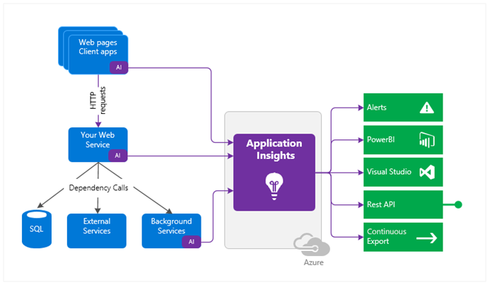
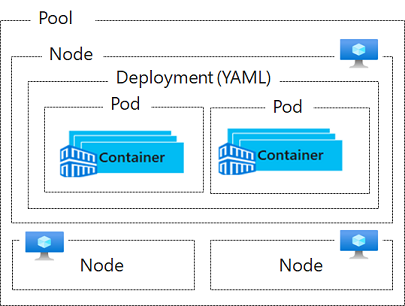
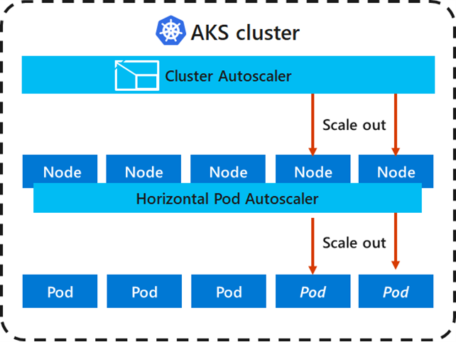

- [Azure Virtual Machines](#azure-virtual-machines)
  - [IaaS business scenarios](#iaas-business-scenarios)
  - [Pricing options](#pricing-options)
  - [Virtual machine sizing](#virtual-machine-sizing)
  - [Virtual Machine storage](#virtual-machine-storage)
    - [Unmanaged disks](#unmanaged-disks)
    - [Managed disks](#managed-disks)
  - [Connect to virtual machines](#connect-to-virtual-machines)
    - [Bastion connections](#bastion-connections)
  - [Virtual Machine availability](#virtual-machine-availability)
    - [Availability sets](#availability-sets)
    - [Servie Level Agreements](#servie-level-agreements)
    - [Update and Fault Domains](#update-and-fault-domains)
    - [Availability Zones](#availability-zones)
    - [Scaling in Azure](#scaling-in-azure)
    - [Scale sets](#scale-sets)
  - [Virtual machines extensions](#virtual-machines-extensions)
    - [Custom script extensions](#custom-script-extensions)
    - [Desired state configuration](#desired-state-configuration)
  - [Useful VM labs](#useful-vm-labs)
- [App Service Plans](#app-service-plans)
  - [App runs and scales](#app-runs-and-scales)
  - [App service plan pricing](#app-service-plan-pricing)
  - [Scal up and scale out the app service](#scal-up-and-scale-out-the-app-service)
  - [Create an app service](#create-an-app-service)
    - [Application settings](#application-settings)
    - [Continuous integration and deployment](#continuous-integration-and-deployment)
    - [Automated deployment](#automated-deployment)
    - [Manual deployment](#manual-deployment)
    - [Deployment slots](#deployment-slots)
    - [Secure an app service](#secure-an-app-service)
    - [Configuration settings](#configuration-settings)
    - [Logging and tracing](#logging-and-tracing)
    - [Custom domain names](#custom-domain-names)
    - [Backup an app service](#backup-an-app-service)
    - [What gets backed up](#what-gets-backed-up)
  - [Application Insights](#application-insights)
  - [Useful Labs for Web app in the Azure portal](#useful-labs-for-web-app-in-the-azure-portal)
- [Azure Containers](#azure-containers)
  - [Container Groups](#container-groups)
    - [Deployment options](#deployment-options)
    - [Common scenarios](#common-scenarios)
  - [Docker](#docker)
- [Kubernetes](#kubernetes)
  - [AKS Networking](#aks-networking)
  - [AKS storage](#aks-storage)
    - [Volumes](#volumes)
    - [Persistent volumes](#persistent-volumes)
    - [Storage classes](#storage-classes)
  - [AKS scaling](#aks-scaling)
    - [Cluster autoscaler](#cluster-autoscaler)
    - [Scaling to Azure Container Instances](#scaling-to-azure-container-instances)

## Azure Virtual Machines

Azure Virtual Machines is one of several types of on-demand, scalable computing resources that Azure offers. Typically, you'll choose a virtual machine if you need more control over the computing environment than the choices such as App Service or Cloud Services offer. Azure Virtual Machines provide you with an operating system, storage, and networking capabilities and can run a wide range of applications.

Virtual machines are part of the Infrastructure as a Service (IaaS) offering. IaaS is an instant computing infrastructure, provisioned and managed over the Internet. Quickly scale up and down with demand and pay only for what you use.


### IaaS business scenarios

- **Test and development.** Teams can quickly set up and dismantle test and development environments, bringing new applications to market faster. IaaS makes it quick and economical to scale up dev-test environments up and down.
- **Website hosting.** Running websites using IaaS can be less expensive than traditional web hosting.
- **Storage, backup, and recovery.** Organizations avoid the expense for storage and complexity of storage management. This typically requires a skilled staff to manage data and meet legal and compliance requirements. IaaS is useful for handling unpredictable demand and steadily growing storage needs. It can also simplify planning and management of backup and recovery systems.
- **High-performance computing.** High-performance computing (HPC) on supercomputers, computer grids, or computer clusters helps solve complex problems involving millions of variables or calculations. Examples include earthquake and protein folding simulations, climate and weather predictions, financial modeling, and evaluating product designs.
- **Big data analysis.** Big data is a popular term for massive data sets that contain potentially valuable patterns, trends, and associations. Mining data sets to locate or tease out these hidden patterns requires a huge amount of processing power, which IaaS economically provides.
- **Extended Datacenter.** Add capacity to your datacenter by adding virtual machines in Azure. Avoid the costs of physically adding hardware or space to your physical location. Connect your physical network to the Azure cloud network seamlessly.

### Pricing options

There are two separate costs the subscription will be charged for every VM: compute and storage. By separating these costs, you scale them independently and only pay for what you need.

**Compute costs** - Compute expenses are priced on a per-hour basis but billed on a per-minute basis. For example, you are only charged for 55 minutes of usage if the VM is deployed for 55 minutes. You are not charged for compute capacity if you stop and deallocate the VM since this releases the hardware. The hourly price varies based on the VM size and OS you select. The cost for a VM includes the charge for the Windows operating system. Linux-based instances are cheaper because there is no operating system license charge.

**Storage costs** - You are charged separately for the storage the VM uses. The status of the VM has no relation to the storage charges. Even when a VM is stopped/deallocated, you are charged for the storage used by the disks.

You're able to choose from two payment options for compute costs:

- **Consumption-based** - With the consumption-based option, you pay for compute capacity by the second. You're able to increase or decrease compute capacity on demand and start or stop at any time. Use this option if you run applications with short-term or unpredictable workloads that cannot be interrupted. For example, if you are doing a quick test, or developing an app in a VM, this would be the appropriate option.
- **Reserved Virtual Machine Instances** - The Reserved Virtual Machine Instances (RI) option is an advance purchase of a virtual machine for one or three years in a specified region. The commitment is made up front, and in return, you get up to 72% price savings compared to pay-as-you-go pricing. RIs are flexible and can easily be exchanged or returned for an early termination fee. Use this option if the VM has to run continuously, or you need budget predictability, and you can commit to using the VM for at least a year.

### Virtual machine sizing

| Type | Example Usage |
| - | - |
| General purpose | Balanced CPU-to-memory ratio. Ideal for testing and development, small to medium databases, and low medium traffic web servers.
| Compute optimized | High CPU-to-memory ratio. Good for medium traffic web server, network appliances, batch processes, and application servers.
| Memory optimized | High memory-to-CPU ratio. Great for relational database servers, medium to large caches, and in-memory analytics.
| Storage optimized | High disk throughput and IO ideal for Big Data, SQL, NoSQL databases, data warehousing, and large transactional databases.
| GPU | Specialized virtual machines targeted for heavy graphic rendering and video editing, as well as model training and inferencing (ND) with deep learning. Available with single or multiple GPUs.
| High performance compute | Our fastest and most powerful CPU virtual machines with optional high-throughput network interfaces (RDMA)

---
Note 

Azure allows you to change the VM size when the existing size no longer meets your needs. You can resize a VM if your current hardware configuration is allowed in the new size. This provides a fully agile and elastic approach to VM management.

When you stop and deallocate the VM, you can select any size available in your region.

---

### Virtual Machine storage

ust like any other computer, virtual machines in Azure use disks as a place to store an operating system, applications, and data. All Azure virtual machines have at least two disks – a Windows operating system disk (in the case of a Windows VM) and a temporary disk. Virtual machines also can have one or more data disks. All disks are stored as VHDs.

- **Operating system disks** Every virtual machine has one attached operating system disk. That OS disk has a pre-installed OS, which was selected when the VM was created. It’s registered as a SATA drive and labeled as the C: drive by default.
- **Temporary disk** Data on the temporary disk may be lost during a maintenance event or when you redeploy a VM. During a standard reboot of the VM, the data on the temporary drive should persist. However, there are cases where the data may not persist, such as moving to a new host. Therefore, any data on the temp drive should not be data that is critical to the system.

  - On Windows virtual machines, this disk is labeled as the D: drive by default and it used for storing pagefile.sys.
  - On Linux virtual machines, the disk is typically /dev/sdb and is formatted and mounted to /mnt by the Azure Linux Agent.
- **Data disks** A data disk is a managed disk that's attached to a virtual machine to store application data, or other data you need to keep. Data disks are registered as SCSI drives and are labeled with a letter that you choose. The size of the virtual machine determines how many data disks you can attach to it and the type of storage you can use to host the disks.
- **Virtual machine storage options** 
  - **Azure Premium Storage** delivers high-performance, low-latency disk support for virtual machines with input/output(I/O)-intensive workloads. VM disks that use Premium Storage store data on solid-state drives (SSDs)
  - **Standard Disks** If your disk does not require high IOPS, you can help limit costs by keeping it in standard Azure Storage. In standard storage, VM disk data is stored on hard disk drives (HDDs) instead of on SSDs.

#### Unmanaged disks

The original method is to use unmanaged disks. In an unmanaged disk, you manage the storage accounts that you use to store the virtual hard disk (VHD) files that correspond to your VM disks. VHD files are stored as page blobs in Azure storage accounts.

#### Managed disks

An Azure-managed disk is a virtual hard disk (VHD). You can think of it like a physical disk in an on-premises server but, virtualized. Azure-managed disks are stored as page blobs, which are a random IO storage object in Azure. We call a managed disk ‘managed’ because it is an abstraction over page blobs, blob containers, and Azure storage accounts. With managed disks, all you have to do is provision the disk, and Azure takes care of the rest. When you select to use Azure-managed disks with your workloads, Azure creates and manages the disk for you. The available types of disks are Ultra Solid State Drives (SSD), Premium SSD, Standard SSD, and Standard Hard Disk Drives (HDD).

### Connect to virtual machines

- Windows-based virtual machines (RDP) 3389 & (WinRM) 5986
- Linux-based virtual machines (SSH client) 22

#### Bastion connections

The Azure Bastion service is a new fully platform-managed PaaS service that you provision inside your virtual network. It provides secure and seamless RDP/SSH connectivity to your virtual machines directly in the Azure portal over SSL. When you connect via Azure Bastion, your virtual machines do not need a public IP address.

Bastion provides secure RDP and SSH connectivity to all VMs in the virtual network in which it is provisioned. Using Azure Bastion protects your virtual machines from exposing RDP/SSH ports to the outside world while still providing secure access using RDP/SSH. With Azure Bastion, you connect to the virtual machine directly from the Azure portal. You don't need an additional client, agent, or piece of software.

### Virtual Machine availability

As an Azure administrator you must be prepared for planned and unplanned failures. There are three scenarios that can lead to your virtual machine in Azure being impacted: unplanned hardware maintenance, unexpected downtime, and planned maintenance. [details here](https://docs.microsoft.com/en-gb/learn/modules/configure-virtual-machine-availability/2-plan-for-maintenance-downtime
)

#### Availability sets

An Availability Set is a logical feature used to ensure that a group of related VMs are deployed so that they aren't all subject to a single point of failure and not all upgraded at the same time during a host operating system upgrade in the datacenter.

Availability Sets are an essential capability when you want to build reliable cloud solutions. Keep these general principles in mind.

- For redundancy, configure multiple virtual machines in an Availability Set.
- Configure each application tier into separate Availability Sets.
- Combine a Load Balancer with Availability Sets.
- Use managed disks with the virtual machines.

#### Servie Level Agreements 

- For all Virtual Machines that have two or more instances deployed across two or more Availability Zones in the same Azure region, we guarantee you will have Virtual Machine Connectivity to at least one instance at least 99.99% of the time.
- For all Virtual Machines that have two or more instances deployed in the same Availability Set, we guarantee you will have Virtual Machine Connectivity to at least one instance at least 99.95% of the time.
- For any Single Instance Virtual Machine using premium storage for all Operating System Disks and Data Disks, we guarantee you will have Virtual Machine Connectivity of at least 99.9%.

---
Note

You can create a virtual machine and an Availability Set at the same time. A VM can only be added to an Availability Set when it is created. To change the Availability Set, you need to delete and then recreate the virtual machine.

---


#### Update and Fault Domains

- **Update domain** is a group of nodes that are upgraded together during the process of a service upgrade (rollout). An update domain allows Azure to perform incremental or rolling upgrades across a deployment. Each update domain contains a set of virtual machines and associated physical hardware that can be updated and rebooted at the same time. During planned maintenance, only one update domain is rebooted at a time. By default, there are five (non-user-configurable) update domains, but you configure up to 20 update domains.
- **Fault domain** is a group of nodes that represent a physical unit of failure. A fault domain defines a group of virtual machines that share a common set of hardware, switches, that share a single point of failure. For example, a server rack serviced by a set of power or networking switches. Two fault domains mitigate against hardware failures, network outages, power interruptions, or software updates. Think of a fault domain as nodes belonging to the same physical rack.

#### Availability Zones

Availability Zones is a high-availability offering that protects your applications and data from datacenter failures.

- Availability Zones are unique physical locations within an Azure region.
- Each zone is made up of one or more datacenters equipped with independent power, cooling, and networking.
- To ensure resiliency, there’s a minimum of three separate zones in all enabled regions.
- The physical separation of Availability Zones within a region protects applications and data from datacenter failures.
- Zone-redundant services replicate your applications and data across Availability Zones to protect from single-points-of-failure.
- With Availability Zones, Azure offers industry best 99.99% VM uptime SLA.

An Availability Zone in an Azure region is a combination of a fault domain and an update domain. For example, if you create three or more VMs across three zones in an Azure region, your VMs are effectively distributed across three fault domains and three update domains. The Azure platform recognizes this distribution across update domains to make sure that VMs in different zones are not updated at the same time. Build high-availability into your application architecture by colocating your compute, storage, networking, and data resources within a zone and replicating in other zones.

Azure services that support Availability Zones fall into two categories:

- Zonal services. Pins the resource to a specific zone (for example, virtual machines, managed disks, Standard IP addresses).
- Zone-redundant services. Platform replicates automatically across zones (for example, zone-redundant storage, SQL Database).

#### Scaling in Azure

Vertical (change size of VM up or down) and Horizontal (increase or decrease number of VM instance)

- Vertical scaling generally has more limitations. Vertical scaling dependent on the availability of larger hardware, which quickly hits an upper limit and can vary by region. Vertical scaling also usually requires a virtual machine to stop and restart.
- Horizontal scaling is more flexible in a cloud situation as it allows you to run potentially thousands of virtual machines to handle load.
- Reprovisioning means removing an existing virtual machine and replacing it with a new one. Do you need to retain your data?

#### Scale sets

Virtual machine scale sets are an Azure Compute resource you can use to deploy and manage a set of identical VMs. With all VMs configured the same, virtual machine scale sets are designed to support true autoscale. No pre-provisioning of VMs is required. It is easier to build large-scale services targeting big compute, big data, and containerized workloads. As demand goes up more virtual machine instances can be added. As demand goes down virtual machines instances can be removed. The process can be manual or automated or a combination of both.

- All VM instances are created from the same base OS image and configuration. This approach lets you easily manage hundreds of VMs without additional configuration tasks or network management.
- Scale sets support the use of the Azure load balancer for basic layer-4 traffic distribution, and Azure Application Gateway for more advanced layer-7 traffic distribution and SSL termination.
- Scale sets are used to run multiple instances of your application. If one of these VM instances has a problem, customers continue to access your application through one of the other VM instances with minimal interruption.
- Customer demand for your application may change throughout the day or week. To match customer demand, scale sets can automatically increase the number of VM instances as application demand increases, then reduce the number of VM instances as demand decreases. This is known as autoscale.
- Scale sets support up to 1,000 VM instances. If you create and upload your own custom VM images, the limit is 600 VM instances.

### Virtual machines extensions

Azure virtual machine extensions are small applications that provide post-deployment configuration and automation tasks on Azure VMs. For example, if a virtual machine requires software installation, anti-virus protection, or a configuration script inside, a VM extension can be used. Extensions are all about managing your virtual machines.

Azure VM extensions can be:

- Managed with Azure CLI, PowerShell, Azure Resource Manager templates, and the Azure portal.
- Bundled with a new VM deployment or run against any existing system. For example, they can be part of a larger deployment, configuring applications on VM provision, or run against any supported extension operated systems post deployment.

#### Custom script extensions

Custom Script Extension(CSE) can be used to automatically launch and execute virtual machine customization tasks post configuration. Your script extension may perform simple tasks such as stopping the virtual machine or installing a software component. However, the script could be more complex and perform a series of tasks.

You can install the CSE from the Azure portal by accessing the virtual machines Extensions blade. Once the CSE resource is created, you will provide a PowerShell script file. Your script file will include the PowerShell commands you want to execute on the virtual machine. Optionally, you can pass in arguments, such as param1, param2. After the file is uploaded, it executes immediately. Scripts can be downloaded from Azure storage or GitHub, or provided to the Azure portal at extension run time.

**Considerations**

- **Timeout.** Custom Script extensions have 90 minutes to run. If your deployment exceeds this time, it is marked as a timeout. Keep this in mind when designing your script. Your virtual machine must be running to perform the tasks.
- **Dependencies.** If your extension requires networking or storage access, make sure that content is available.
- **Failure events.** Be sure to account for any errors that might occur when running your script. For example, running out of disk space, or security and access restrictions. What will the script do if there is an error?
- **Sensitive data.** Your extension may need sensitive information such as credentials, storage account names, and storage account access keys. How will you protect/encrypt this information?


#### Desired state configuration

Desired State Configuration (DSC) is a management platform in Windows PowerShell. DSC enables deploying and managing configuration data for software services and managing the environment in which these services run. DSC provides a set of Windows PowerShell language extensions, Windows PowerShell cmdlets, and resources that you can use to declaratively specify how you want your software environment to be configured. DSC also provides a means to maintain and manage existing configurations.

DSC centers around creating configurations. A configuration is an easy-to-read script that describes an environment made up of computers (nodes) with specific characteristics. These characteristics can be as simple as ensuring a specific Windows feature is enabled or as complex as deploying SharePoint. Use DSC when the CSE will not work for your application.

In this example, we are installing IIS on the localhost. The configuration is saved as a PS1 file.

```PowerShell
configuration IISInstall
{
Node “localhost”
{
WindowsFeature IIS
{
Ensure = “Present”
Name = “Web-Server”
} } }
```
The DSC script consists of a Configuration block, Node block, and one or more resource blocks.

- **The Configuration block.** This is the outermost script block. You define it by using the Configuration keyword and providing a name. In the example, the name of the configuration is IISInstall.
- **One or more Node blocks.** Node blocks define the computers or VMs that you are configuring. In the example, there is one Node block that targets a computer named "localhost".
- **One or more resource blocks.** Resource blocks configure the resource properties. In the example, there is one resource block that uses WindowsFeature. WindowsFeature indicates the name (Web-Server) of the role or feature that you want to ensure is added or removed. Ensure indicates if the role or feature is added. Your choices are Present and Absent.

---
Note

The Windows PowerShell DSC comes with a set of built-in configuration resources. For example, File resource, Log Resource, and User Resource.

---

### Useful VM labs

Here is a list of useful tutorials to ramp up with Azure VM deployment

- [Manage virtual machines with the Azure CLI](https://docs.microsoft.com/en-gb/learn/modules/manage-virtual-machines-with-azure-cli/4-other-vm-images)

- [Windows virtual machines](https://docs.microsoft.com/en-gb/learn/modules/create-windows-virtual-machine-in-azure/1-introduction)

- [Azure Automation State Configuration](https://docs.microsoft.com/en-gb/learn/modules/protect-vm-settings-with-dsc/1-introduction)


## App Service Plans

In App Service, an app runs in an App Service plan. An App Service plan defines a set of compute resources for a web app to run. These compute resources are analogous to the server farm in conventional web hosting. One or more apps can be configured to run on the same computing resources (or in the same App Service plan).

When you create an App Service plan in a certain region (for example, West Europe), a set of compute resources is created for that plan in that region. Whatever apps you put into this App Service plan run on these compute resources as defined by your App Service plan. Each App Service plan defines:

- Region (West US, East US, etc.)
- Number of VM instances
- Size of VM instances (Small, Medium, Large)

Reasons to use App Services

- **Multiple languages and frameworks.** App Service has first-class support for ASP.NET, Java, Ruby, Node.js, PHP, or Python. You can also run PowerShell and other scripts or executables as background services.
- **DevOps optimization.** Set up continuous integration and deployment with Azure DevOps, GitHub, BitBucket, Docker Hub, or Azure Container Registry. - **Promote updates through test and staging environments.** Manage your apps in App Service by using Azure PowerShell or the cross-platform command-line interface (CLI).
- **Global scale with high availability.** Scale up or out manually or automatically. Host your apps anywhere in Microsoft's global datacenter infrastructure, and the App Service SLA promises high availability.
- **Connections to SaaS platforms and on-premises data.** Choose from more than 50 connectors for enterprise systems (such as SAP), SaaS services (such as Salesforce), and internet services (such as Facebook). Access on-premises data using Hybrid Connections and Azure Virtual Networks.
- **Security and compliance.** App Service is ISO, SOC, and PCI compliant. Authenticate users with Azure Active Directory or with social login (Google, Facebook, Twitter, and Microsoft). Create IP address restrictions and manage service identities.
- **Application templates.** Choose from an extensive list of application templates in the Azure Marketplace, such as WordPress, Joomla, and Drupal.
Visual Studio integration. Dedicated tools in Visual Studio streamline the work of creating, deploying, and debugging.
- **API and mobile features.** App Service provides turn-key CORS support for RESTful API scenarios, and simplifies mobile app scenarios by enabling authentication, offline data sync, push notifications, and more.
- **Serverless code.** Run a code snippet or script on-demand without having to explicitly provision or manage infrastructure and pay only for the compute time your code actually uses.


### App runs and scales

In the Free and Shared tiers, an app receives CPU minutes on a shared VM instance and cannot scale out. In other tiers, an app runs and scales as follows.

When you create an app in App Service, it is put into an App Service plan. When the app runs, it runs on all the VM instances configured in the App Service plan. If multiple apps are in the same App Service plan, they all share the same VM instances. If you have multiple deployment slots for an app, all deployment slots also run on the same VM instances. If you enable diagnostic logs, perform backups, or run WebJobs, they also use CPU cycles and memory on these VM instances.

In this way, the App Service plan is the scale unit of the App Service apps. If the plan is configured to run five VM instances, then all apps in the plan run on all five instances. If the plan is configured for autoscaling, then all apps in the plan are scaled out together based on the autoscale settings.

**Considerations**

Isolate your app into a new App Service plan when:

- The app is resource-intensive.
- You want to scale the app independently from the other apps in the existing plan.
- The app needs resource in a different geographical region.


### App service plan pricing

[This link provides](https://docs.microsoft.com/en-gb/learn/modules/configure-app-service-plans/3-determine-plan-pricing) a table summarizing different tiers

### Scal up and scale out the app service

There are two methods for Web App scaling, scale up and scale out. Apps can be scaled manually or automatically (autoscale).

**Scale up.** Get more CPU, memory, disk space, and extra features like dedicated virtual machines (VMs), custom domains and certificates, staging slots, autoscaling, and more. You scale up by changing the pricing tier of the App Service plan that your app belongs to.

**Scale out:** Increase the number of VM instances that run your app. You can scale out to as many as 30 instances, depending on your pricing tier. App Service Environments in Isolated tier further increases your scale-out count to 100 instances. The scale instance count can be configured manually or automatically (autoscale). Autoscale is based on predefined rules and schedules.

our App Service plan can be scaled up and down at any time. It is as simple as changing the pricing tier of the plan. You can choose a lower pricing tier at first and scale up later when you need more App Service features.

For example, you can start testing your web app in a Free App Service plan and pay nothing. When you want to add your custom DNS name to the web app, just scale your plan up to the Shared tier. Later, when you want to create an SSL binding, scale your plan up to Basic tier. When you want to have staging environments, scale up to Standard tier. When you need more cores, memory, or storage, scale up to a bigger VM size in the same tier.

The same works in the reverse. When you feel you no longer need the capabilities or features of a higher tier, you can scale down to a lower tier, which saves you money.

- The scale settings take only seconds to apply and affect all apps in your App Service plan. They don't require you to change your code or redeploy your application.
- If your app depends on other services, such as Azure SQL Database or Azure Storage, you can scale up these resources separately. These resources aren't managed by the App Service plan.

Autoscale allows you to have the right amount of resources running to handle the load on your application. It allows you to add resources to handle increases in load and also save money by removing resources that are sitting idle. You specify a minimum and maximum number of instances to run and add or remove VMs automatically based on a set of rules. When rule conditions are met, one or more autoscale actions are triggered.

Rules include a trigger and a scale action (in or out). The trigger can be metric-based or time-based.

- Metric-based. Metric-based rules measure application load and add or remove VMs based on that load. For example, do this action when CPU usage is above 50%. Examples of metrics are CPU time, Average response time, and Requests.
- Time-based. Time-based (schedule-based) rules allow you to scale when you see time patterns in your load and want to scale before a possible load increase or decrease occurs. For example, trigger a webhook every 8am on Saturday in a given time zone.

**Considerations**

- Set up notifications.

### Create an app service

When creating an App Service, you will need to specify a resource group and service plan. Then there are few other configuration choices. You may need to ask your developer for assistance in completing this information

- **Name.** The name must be unique and will be used to locate your app. For example, webappces1.azurewebsites.net. You can map a custom domain name, if you prefer to use that instead.
- **Publish.** The App service can host either Code or a Docker Container.
Runtime stack. The software stack to run the app, including the language and SDK versions. For Linux apps and custom container apps, you can also set an optional start-up command or file. Choices include: .NET Core, .NET Framework, Node.js, PHP, Python, and Ruby. Various versions of each are available.
- **Operating system.** Choices are Linux and Windows.
- **Region.** Your choice will affect app service plan availability.

#### Application settings

Once your app service is created, additional configuration information is available.

Certain configuration settings can be included in the developer's code or configurated in the app service. Here are a few interesting settings.

- **Always On.** Keep the app loaded even when there's no traffic. It's required for continuous WebJobs or for WebJobs that are triggered using a CRON expression.
- **ARR affinity.** In a multi-instance deployment, ensure that the client is routed to the same instance for the life of the session.
- **Connection strings.** Connection strings are encrypted at rest and transmitted over an encrypted channel.

#### Continuous integration and deployment

The Azure portal provides out-of-the-box continuous integration and deployment with Azure DevOps, GitHub, Bitbucket, FTP, or a local Git repository on your development machine. Connect your web app with any of the above sources and App Service will do the rest for you by auto-syncing code and any future changes on the code into the web app. Furthermore, with Azure DevOps, you can define your own build and release process that compiles your source code, runs the tests, builds a release, and finally deploys the release into your web app every time you commit the code. All that happens implicitly without any need to intervene.

#### Automated deployment

The following options are available:

- **Azure DevOps:** You can push your code to Azure DevOps (previously known as Visual Studio Team Services), build your code in the cloud, run the tests, generate a release from the code, and finally, push your code to an Azure Web App.
- **GitHub:** Azure supports automated deployment directly from GitHub. When you connect your GitHub repository to Azure for automated deployment, any changes you push to your production branch on GitHub will be automatically deployed for you.
- **Bitbucket:** With its similarities to GitHub, you can configure an automated deployment with Bitbucket.

#### Manual deployment

There are a few options that you can use to manually push your code to Azure:

- **Git:** App Service web apps feature a Git URL that you can add as a remote repository. Pushing to the remote repository will deploy your app.
- **CLI:** webapp up is a feature of the command-line interface that packages your app and deploys it. Deployment can include creating a new App Service web app.
- **Visual Studio:** Visual Studio features an App Service deployment wizard that can walk you through the deployment process.
- **FTP/S:** FTP or FTPS is a traditional way of pushing your code to many hosting environments, including App Service.

#### Deployment slots

When you deploy your web app, web app on Linux, mobile back end, or API app to Azure App Service, you can use a separate deployment slot instead of the default production slot when you're running in the Standard, Premium, or Isolated App Service plan tier. Deployment slots are live apps with their own hostnames. App content and configurations elements can be swapped between two deployment slots, including the production slot.

Using separate staging and production slots has several advantages.

- You can validate app changes in a staging deployment slot before swapping it with the production slot.
- Deploying an app to a slot first and swapping it into production ensures that all instances of the slot are warmed up before being swapped into production. This eliminates downtime when you deploy your app. The traffic redirection is seamless, and no requests are dropped because of swap operations. This entire workflow can be automated by configuring Auto Swap when pre-swap validation is not needed.
- After a swap, the slot with previously staged app now has the previous production app. If the changes swapped into the production slot are not as you expected, you can perform the same swap immediately to get your “last known good site” back.

[Details of deplooyment slots](https://docs.microsoft.com/en-gb/learn/modules/configure-azure-app-services/6-add-deployment-slots)

#### Secure an app service

Azure App Service provides built-in authentication and authorization support, so you can sign in users and access data by writing minimal or no code in your web app, API, and mobile back end, and also Azure Functions.

Secure authentication and authorization requires deep understanding of security, including federation, encryption, JSON web tokens (JWT) management, grant types, and so on. App Service provides these utilities so that you can spend more time and energy on providing business value to your customer.

The authentication and authorization module runs in the same sandbox as your application code. When it's enabled, every incoming HTTP request passes through it before being handled by your application code. This module handles several things for your app:

- Authenticates users with the specified provider.
- Validates, stores, and refreshes tokens.
- Manages the authenticated session.
- Injects identity information into request headers.
The module runs separately from your application code and is configured using app settings. No SDKs, specific languages, or changes to your application code are required.

#### Configuration settings

In the Azure portal, you can configure App Service with a number of behaviors:

1. Allow Anonymous requests (no action): This option defers authorization of unauthenticated traffic to your application code. For authenticated requests, App Service also passes along authentication information in the HTTP headers.This option provides more flexibility in handling anonymous requests. It lets you present multiple sign-in providers to your users.
1. Allow only authenticated requests: The option is Log in with . App Service redirects all anonymous requests to /.auth/login/<provider> for the provider you choose. If the anonymous request comes from a native mobile app, the returned response is an HTTP 401 Unauthorized. With this option, you don't need to write any authentication code in your app.

#### Logging and tracing

If you enable application logging, you will see authentication and authorization traces directly in your log files. If you see an authentication error that you didn’t expect, you can conveniently find all the details by looking in your existing application logs. If you enable failed request tracing, you can see exactly what role the authentication and authorization module may have played in a failed request. In the trace logs, look for references to a module named EasyAuthModule_32/64.

#### Custom domain names

[How to configure domain names](https://docs.microsoft.com/en-gb/learn/modules/configure-azure-app-services/8-create-custom-domain-names)

#### Backup an app service

The Backup and Restore feature in Azure App Service lets you easily create app backups manually or on a schedule. You can configure the backups to be retained up to an indefinite amount of time. You can restore the app to a snapshot of a previous state by overwriting the existing app or restoring to another app.

#### What gets backed up

App Service can back up the following information to an Azure storage account and container that you have configured your app to use.

- App configuration.
- File content.
- Database connected to your app (SQL Database, Azure Database for MySQL, Azure Database for PostgreSQL, MySQL in-app).

- The Backup and Restore feature requires the App Service plan to be in the Standard tier or Premium tier.
- You can configure backups manually or on a schedule.
- You need an Azure storage account and container in the same subscription as the app that you want to back up. After you have made one or more backups for your app, the backups are visible on the Containers page of your storage account, and your app. In the storage account, each backup consists of a.zip file that contains the backup data and an .xml file that contains a manifest of the .zip file contents. You can unzip and browse these files if you want to access your backups without actually performing an app restore.
- Full backups are the default. When a full backup is restored, all content on the site is replaced with whatever is in the backup. If a file is on the site, but not in the backup it gets deleted.
- Partial backups are supported. Partial backups allow you choose exactly which files you want to back up. When a partial backup is restored, any content that is located in one of the excluded directories, or any excluded file, is left as is. You restore partial backups of your site the same way you would restore a regular backup.
- You can exclude files and folders you do not want in the backup.
- Backups can be up to 10 GB of app and database content.
- Using a firewall enabled storage account as the destination for your backups is not supported.

### Application Insights

Application Insights, a feature of Azure Monitor, monitors your live applications. It will automatically detect performance anomalies, and includes powerful analytics tools to help you diagnose issues and to understand what users actually do with your app. It's designed to help you continuously improve performance and usability. Insights works on various platforms including .NET, Node.js and Java EE, hosted on-premises, hybrid, or any public cloud. It integrates with your DevOps process, and has connection points to a variety of development tools. It can monitor and analyze data from mobile apps by integrating with Visual Studio App Center.



Application Insights is aimed at the development team, to help you understand how your app is performing and how it's being used. It monitors:

- **Request rates, response times, and failure rates** - Find out which pages are most popular, at what times of day, and where your users are. See which pages perform best. If your response times and failure rates go high when there are more requests, then perhaps you have a resourcing problem.
Dependency rates, response times, and failure rates - Find out whether external services are slowing you down.
- **Exceptions** - Analyze the aggregated statistics, or pick specific instances and drill into the stack trace and related requests. Both server and browser exceptions are reported.
- **Page views and load performance** - reported by your users' browsers.
User and session counts.
- **Performance counters** from your Windows or Linux server machines, such as CPU, memory, and network usage.
- **Host diagnostics** from Docker or Azure.
- **Diagnostic trace logs** from your app - so that you can correlate trace events with requests.
- **Custom events and metrics** that you write yourself in the client or server code, to track business events such as items sold or games won.

### Useful Labs for Web app in the Azure portal

[Create a web app in the Azure portal](https://docs.microsoft.com/en-gb/learn/modules/host-a-web-app-with-azure-app-service/2-create-a-web-app-in-the-azure-portal)

## Azure Containers

Hardware virtualization has made it possible to run multiple isolated instances of operating systems concurrently on the same physical hardware. Containers represent the next stage in the virtualization of computing resources. Container-based virtualization allows you to virtualize the operating system. This way, you can run multiple applications within the same instance of an operating system, while maintaining isolation between the applications. This means that containers within a VM provide functionality similar to that of VMs within a physical server. To better understand this concept, it is helpful to compare containers and virtual machines.

| Feature | Containers | Virtual Machines
| - | - | - |
| Isolation | Typically provides lightweight isolation from the host and other containers but doesn't provide as strong a security boundary as a virtual machine. | Provides complete isolation from the host operating system and other VMs. This is useful when a strong security boundary is critical, such as hosting apps from competing companies on the same server or cluster.
| Operating system | Runs the user mode portion of an operating system and can be tailored to contain just the needed services for your app, using fewer system resources.| Runs a complete operating system including the kernel, thus requiring more system resources (CPU, memory, and storage).
| Deployment | Deploy individual containers by using Docker via command line; deploy multiple containers by using an orchestrator such as Azure Kubernetes Service.| Deploy individual VMs by using Windows Admin Center or Hyper-V Manager; deploy multiple VMs by using PowerShell or System Center Virtual Machine Manager.
| Persistent storage | Use Azure Disks for local storage for a single node, or Azure Files (SMB shares) for storage shared by multiple nodes or servers.| Use a virtual hard disk (VHD) for local storage for a single VM, or an SMB file share for storage shared by multiple servers.
| Fault tolerance | If a cluster node fails, any containers running on it are rapidly recreated by the orchestrator on another cluster node. | VMs can fail over to another server in a cluster, with the VM's operating system restarting on the new server.

**Container advantages**

Containers offer several advantages over physical and virtual machines, including:

- Increased flexibility and speed when developing and sharing the application code.
- Simplified application testing.
- Streamlined and accelerated application deployment.
- Higher workload density, resulting in improved resource utilization.

| Feature | Description
| - | - |
| Fast Startup Times | Containers can start in seconds without the need to provision and manage virtual machines
| Public IP connectivity and DNS Names | Containers can be directly exposed to the internet with an IP address and FQDN.
| Hypervisor-level Security | Container apps are as isolated in a container as they would be in a virtual machine.
| Custom Sizes | Container nodes can be scaled dynamically to match actual resource demands for an application.
| Persistent Storage | Containers support direct mounting of Azure File Shares
| Linux and Windows Containers | Container instances can schedule both Windows and Linux containers. Simply specify the OS type when you create your container groups.
| Coscheduled Groups | Container instances supports scheduling of multi-container groups that share host machine resources.
| Virtual Network Deployment | Container instances can be deployed into an Azure virtual network.

### Container Groups

The top-level resource in Azure Container Instances is the container group. A container group is a collection of containers that get scheduled on the same host machine. The containers in a container group share a lifecycle, resources, local network, and storage volumes. It's similar in concept to a pod in Kubernetes.

An example container group:

- Is scheduled on a single host machine.
- Is assigned a DNS name label.
- Exposes a single public IP address, with one exposed port.
- Consists of two containers. One container listens on port 80, while the other listens on port 1433.
- Includes two Azure file shares as volume mounts, and each container mounts one of the shares locally.

#### Deployment options

Here are two common ways to deploy a multi-container group: use a Resource Manager template or a YAML file. A Resource Manager template is recommended when you need to deploy additional Azure service resources (for example, an Azure Files share) when you deploy the container instances. Due to the YAML format's more concise nature, a YAML file is recommended when your deployment includes only container instances.

Container groups can share an external-facing IP address, one or more ports on that IP address, and a DNS label with a fully qualified domain name (FQDN). To enable external clients to reach a container within the group, you must expose the port on the IP address and from the container. Because containers within the group share a port namespace, port mapping isn't supported. A container group's IP address and FQDN will be released when the container group is deleted.

#### Common scenarios

Multi-container groups are useful in cases where you want to divide a single functional task into a small number of container images. These images can then be delivered by different teams and have separate resource requirements. Example usage could include:

- A container serving a web application and a container pulling the latest content from source control.
- An application container and a logging container. The logging container collects the logs and metrics output by the main application and writes them to long-term storage.
- An application container and a monitoring container. The monitoring container periodically makes a request to the application to ensure that it's running and responding correctly, and raises an alert if it's not.
- A front-end container and a back-end container. The front end might serve a web application, with the back end running a service to retrieve data.

### Docker

Docker is a platform that enables developers to host applications within a container.

A container is essentially a standalone package that contains everything that is needed to execute a piece of software. The package includes:

- The application executable code.
- The runtime environment (such as .NET Core).
- System tools.
- Settings.
The Docker platform is available on both Linux and Windows and can be hosted on Azure. The key thing that Docker provides is the guarantee that the containerized software will always run the same. It doesn't matter if the code is run locally on Windows, Linux or in the cloud on Azure. The software can be developed locally within a Docker container, shared with Quality Assurance resources for testing. and then deployed to production in the Azure Cloud. Once deployed, the application can easily be scaled using the Azure Container Instances (ACI).

## Kubernetes

**AKS terminology**



**Pools** are groups of nodes with identical configurations.

**Nodes** are individual virtual machines running containerized applications.

**Pods** are a single instance of an application. A pod can contain multiple containers.

**Container** is a lightweight and portable executable image that contains software and all of its dependencies.

**Deployment** has one or more identical pods managed by Kubernetes.

**Manifest** is the YAML file describing a deployment.

A Kubernetes cluster is divided into two components:

- **Azure-managed nodes**, which provide the core Kubernetes services and orchestration of application workloads. This node is provided as a managed Azure resource abstracted from the user. You pay only for running agent nodes
- **Customer-managed nodes** that run your application workloads. An AKS cluster contains one or more nodes (Azure Virtual Machines) that run the Kubernetes node components and the container runtime.

  - The kubelet is the Kubernetes agent that processes the orchestration requests from the Azure-managed node, and scheduling of running the requested containers.
  - Virtual networking is handled by the kube-proxy on each node. The proxy routes network traffic and manages IP addressing for services and pods.
  - The container runtime is the component that allows containerized applications to run and interact with additional resources such as the virtual network and storage. AKS clusters using Kubernetes version 1.19 node pools and greater use containerd as its container runtime. AKS clusters using Kubernetes prior to v1.19 for node pools use Moby (upstream docker) as its container runtime.

### AKS Networking

To allow access to your applications, or for application components to communicate with each other, Kubernetes provides an abstraction layer to virtual networking. Kubernetes nodes are connected to a virtual network, and can provide inbound and outbound connectivity for pods. The kube-proxy component runs on each node to provide these network features.

In Kubernetes, Services logically group pods to allow for direct access via an IP address or DNS name and on a specific port. You can also distribute traffic using a load balancer. More complex routing of application traffic can also be achieved with Ingress Controllers. Security and filtering of the network traffic for pods is possible with Kubernetes network policies.

The Azure platform also helps to simplify virtual networking for AKS clusters. When you create a Kubernetes load balancer, the underlying Azure load balancer resource is created and configured. As you open network ports to pods, the corresponding Azure network security group rules are configured. For HTTP application routing, Azure can also configure external DNS as new ingress routes are configured.

### AKS storage

Applications that run in Azure Kubernetes Service (AKS) may need to store and retrieve data. For some application workloads, this data storage can use local, fast storage on the node that is no longer needed when the pods are deleted. Other application workloads may require storage that persists on more regular data volumes within the Azure platform. Multiple pods may need to share the same data volumes, or reattach data volumes if the pod is rescheduled on a different node. Finally, you may need to inject sensitive data or application configuration information into pods.

This section introduces the core concepts that provide storage to your applications in AKS:

- Volumes
- Persistent volumes
- Storage classes
- Persistent volume claims

#### Volumes

Traditional volumes to store and retrieve data are created as Kubernetes resources backed by Azure Storage. You can manually create these data volumes to be assigned to pods directly, or have Kubernetes automatically create them. These data volumes can use Azure Disks or Azure Files:

- Azure Disks can be used to create a Kubernetes DataDisk resource. Disks can use Azure Premium storage, backed by high-performance SSDs, or Azure Standard storage, backed by regular HDDs. For most production and development workloads, use Premium storage. Azure Disks are mounted as ReadWriteOnce, so are only available to a single node. For storage volumes that can be accessed by multiple nodes simultaneously, use Azure Files.
- Azure Files can be used to mount an SMB 3.0 share backed by an Azure Storage account to pods. Files let you share data across multiple nodes and pods. Files can use Azure Standard storage backed by regular HDDs, or Azure Premium storage, backed by high-performance SSDs.

#### Persistent volumes

Volumes are defined and created as part of the pod lifecycle only exist until the pod is deleted. Pods often expect their storage to remain if a pod is rescheduled on a different host during a maintenance event, especially in StatefulSets. A persistent volume (PV) is a storage resource created and managed by the Kubernetes API that can exist beyond the lifetime of an individual pod.

Azure Disks or Files are used to provide the PersistentVolume. As noted in the previous section on Volumes, the choice of Disks or Files is often determined by the need for concurrent access to the data or the performance tier.

A PersistentVolume can be statically created by a cluster administrator, or dynamically created by the Kubernetes API server. If a pod is scheduled and requests storage that is not currently available, Kubernetes can create the underlying Azure Disk or Files storage and attach it to the pod. Dynamic provisioning uses a StorageClass to identify what type of Azure storage needs to be created.

#### Storage classes

To define different tiers of storage, such as Premium and Standard, you can create a StorageClass. The StorageClass also defines the reclaimPolicy. This reclaimPolicy controls the behavior of the underlying Azure storage resource when the pod is deleted and the persistent volume may no longer be required. The underlying storage resource can be deleted, or retained for use with a future pod.

In AKS, four initial StorageClasses are created for cluster using the in-tree storage plugins:

- default - Uses Azure StandardSSD storage to create a Managed Disk. The reclaim policy ensures that the underlying Azure Disk is deleted when the persistent volume that used it is deleted.
- managed-premium - Uses Azure Premium storage to create a Managed Disk. The reclaim policy again ensures that the underlying Azure Disk is deleted when the persistent volume that used it is deleted.
- azurefile - Uses Azure Standard storage to create an Azure File Share. The reclaim policy ensures that the underlying Azure File Share is deleted when the persistent volume that used it is deleted.
- azurefile-premium - Uses Azure Premium storage to create an Azure File Share. The reclaim policy ensures that the underlying Azure File Share is deleted when the persistent volume that used it is deleted.
If no StorageClass is specified for a persistent volume, the default StorageClass is used. Take care when requesting persistent volumes so that they use the appropriate storage you need. You can create a StorageClass for additional needs using kubectl.

### AKS scaling

As you run applications in Azure Kubernetes Service (AKS), you may need to increase or decrease the amount of compute resources. As the number of application instances you need change, the number of underlying Kubernetes nodes may also need to change. You may also need to quickly provision a large number of additional application instances.



#### Cluster autoscaler

To respond to changing pod demands, Kubernetes has a cluster autoscaler that adjusts the number of nodes based on the requested compute resources in the node pool. By default, the cluster autoscaler checks the API server every 10 seconds for any required changes in node count. If the cluster autoscale determines that a change is required, the number of nodes in your AKS cluster is increased or decreased accordingly. The cluster autoscaler works with RBAC-enabled AKS clusters that run Kubernetes 1.10.x or higher.

Cluster autoscaler is typically used alongside the horizontal pod autoscaler. When combined, the horizontal pod autoscaler increases or decreases the number of pods based on application demand, and the cluster autoscaler adjusts the number of nodes as needed to run those additional pods accordingly.

[Scale out & Scale in details here](https://docs.microsoft.com/en-gb/learn/modules/configure-azure-kubernetes-service/6-kubernetes-scale-options)

#### Scaling to Azure Container Instances

To rapidly scale your AKS cluster, you can integrate with Azure Container Instances (ACI). Kubernetes has built-in components to scale the replica and node count. However, if your application needs to rapidly scale, the horizontal pod autoscaler may schedule more pods than can be provided by the existing compute resources in the node pool. If configured, this scenario would then trigger the cluster autoscaler to deploy additional nodes in the node pool. It may take a few minutes for those nodes to successfully provision.

ACI lets you quickly deploy container instances without more infrastructure overhead. When you connect with AKS, ACI becomes a secured, logical extension of your AKS cluster. The Virtual Kubelet component is installed in your AKS cluster that presents ACI as a virtual Kubernetes node. Kubernetes can then schedule pods that run as ACI instances through virtual nodes, not as pods on VM nodes directly in your AKS cluster.