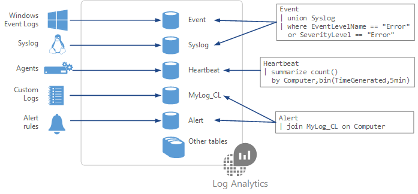

# Azure Log Analytics

Log Analytics is a service in that helps you collect and analyze data generated by resources in your cloud and on-premises environments.

Log queries help you to use the data collected in Azure Monitor Logs. A powerful query language allows you to join data from multiple tables, aggregate large sets of data, and perform complex operations with minimal code. Virtually any question can be answered and analysis performed as long as the supporting data has been collected, and you understand how to construct the right query.

More info [here](https://docs.microsoft.com/en-gb/learn/modules/configure-log-analytics/6-visualize-data)

## Structure Log Analytics queries

When you build a query, you start by determining which tables have the data that you're looking for. Each data source and solution stores its data in dedicated tables in the Log Analytics workspace. Documentation for each data source and solution includes the name of the data type that it creates and a description of each of its properties. Many queries will only require data from a single table, but others may use a variety of options to include data from multiple tables.



ome common query tables are: Event, Syslog, Heartbeat, and Alert.

The basic structure of a query is a source table followed by a series of operators separated by a pipe character |. You can chain together multiple operators to refine the data and perform advanced functions. For example, this query returns a count of the top 10 errors in the Event log during the last day. The results are in descending order.

```kusto
Event
| where (EventLevelName == "Error")
| where (TimeGenerated &gt; ago(1days))
| summarize ErrorCount = count() by Computer
| top 10 by ErrorCount desc
```
