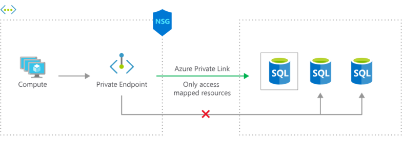
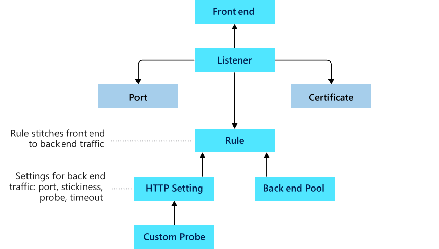

- [Azure Networking](#azure-networking)
  - [Azure Virtual Network (VNet)](#azure-virtual-network-vnet)
    - [Subnets](#subnets)
    - [Plan IP addressing](#plan-ip-addressing)
      - [Tutorial for best practices on IP addressing](#tutorial-for-best-practices-on-ip-addressing)
      - [Private IP addresses](#private-ip-addresses)
      - [Public IP addresses](#public-ip-addresses)
    - [Static vs dynamic addressing](#static-vs-dynamic-addressing)
  - [Network Security Rules (NSG)](#network-security-rules-nsg)
      - [Default Inbound rules](#default-inbound-rules)
      - [Default Outbound rules](#default-outbound-rules)
      - [Determine network security group effective rules](#determine-network-security-group-effective-rules)
    - [NSG on Subnets](#nsg-on-subnets)
    - [NSG on NICs](#nsg-on-nics)
  - [Azure Firewall](#azure-firewall)
    - [Firewall rules](#firewall-rules)
      - [NAT rules](#nat-rules)
      - [Network rules](#network-rules)
      - [Application rules](#application-rules)
      - [Rule processing](#rule-processing)
  - [Azure DNS](#azure-dns)
    - [Domains and Custom domains](#domains-and-custom-domains)
      - [Initial domain name](#initial-domain-name)
      - [Custom domain name](#custom-domain-name)
    - [Azure DNS zones](#azure-dns-zones)
    - [Delegeate DNS domains](#delegeate-dns-domains)
      - [Child Domains](#child-domains)
      - [DNS record sets](#dns-record-sets)
    - [Private DNS zones](#private-dns-zones)
      - [Examples private zone scenarios](#examples-private-zone-scenarios)
    - [Tutorial for Azure DNS](#tutorial-for-azure-dns)
  - [Virtual Network Peering](#virtual-network-peering)
    - [Gateway transit and connectivity](#gateway-transit-and-connectivity)
      - [Create virtual network peering](#create-virtual-network-peering)
    - [Service Chaining uses](#service-chaining-uses)
      - [Hub and spoke architecture](#hub-and-spoke-architecture)
      - [User-defined routes and service chaining](#user-defined-routes-and-service-chaining)
    - [VPN peering tutorial](#vpn-peering-tutorial)
  - [VPN Gateway](#vpn-gateway)
    - [Site-to-site connections](#site-to-site-connections)
    - [Create Gateway subnet](#create-gateway-subnet)
    - [Create teh VPN gateway](#create-teh-vpn-gateway)
    - [Create the local network gateway](#create-the-local-network-gateway)
    - [Setup the on-premises VPN gateway](#setup-the-on-premises-vpn-gateway)
    - [Create the VPN connection](#create-the-vpn-connection)
    - [Azure VPN Gateway high availability scenarios](#azure-vpn-gateway-high-availability-scenarios)
      - [Active/standby](#activestandby)
      - [Active/active](#activeactive)
  - [ExpressRoute and Virtual WAN](#expressroute-and-virtual-wan)
    - [ExpressRoute use cases](#expressroute-use-cases)
    - [Benefits](#benefits)
      - [Layer 3 connectivity](#layer-3-connectivity)
      - [Redundancy](#redundancy)
      - [Connectivity to Microsoft cloud services](#connectivity-to-microsoft-cloud-services)
      - [Connectivity to all regions within a geopolitical region](#connectivity-to-all-regions-within-a-geopolitical-region)
        - [Global connectivity with ExpressRoute premium add-on](#global-connectivity-with-expressroute-premium-add-on)
      - [Across on-premises connectivity with ExpressRoute Global Reach](#across-on-premises-connectivity-with-expressroute-global-reach)
      - [Bandwidth options](#bandwidth-options)
      - [Flexible billing models](#flexible-billing-models)
      - [Coexist site-to-site and Express route](#coexist-site-to-site-and-express-route)
    - [ExpressRoute connection models](#expressroute-connection-models)
      - [Colocated at a cloud exchange](#colocated-at-a-cloud-exchange)
      - [Point-to-point Ethernet connections](#point-to-point-ethernet-connections)
      - [Any-to-any (IPVPN) networks](#any-to-any-ipvpn-networks)
    - [Compare intersite connection options](#compare-intersite-connection-options)
    - [Virtal WAN uses](#virtal-wan-uses)
      - [Virtual WAN advantages](#virtual-wan-advantages)
      - [Virtual WAN types](#virtual-wan-types)
  - [Network routing and endpoints](#network-routing-and-endpoints)
    - [User-defined routes (UDR)](#user-defined-routes-udr)
    - [What is an NVA](#what-is-an-nva)
      - [Example of UDR](#example-of-udr)
    - [Service Endpoint uses](#service-endpoint-uses)
      - [Why use a service endpoint?](#why-use-a-service-endpoint)
      - [Service endpoint services](#service-endpoint-services)
    - [Private link uses](#private-link-uses)
    - [Tutorial to learn routing capabilities](#tutorial-to-learn-routing-capabilities)
  - [Configure Azure Load Balancer](#configure-azure-load-balancer)
    - [Tutorial about configuring Load Balancer](#tutorial-about-configuring-load-balancer)
    - [Public load balancer](#public-load-balancer)
    - [Internal load balancer](#internal-load-balancer)
    - [Load Balancer SKUs](#load-balancer-skus)
    - [Backend pools](#backend-pools)
    - [Configure session persistence](#configure-session-persistence)
    - [Create health probes](#create-health-probes)
  - [Application Gateway](#application-gateway)
    - [Determine Application Gateway routing](#determine-application-gateway-routing)
      - [Path-based routing](#path-based-routing)
      - [Multiple Site routing](#multiple-site-routing)
      - [Other features](#other-features)
    - [Application Gateway component set up](#application-gateway-component-set-up)
      - [Front-end IP address](#front-end-ip-address)
      - [Listeners](#listeners)
      - [Routing rules](#routing-rules)
      - [Back-end pools](#back-end-pools)
      - [Web application firewall](#web-application-firewall)
      - [Health process](#health-process)
# Azure Networking

Azure networking components offer a range of functionalities and services.

- Virtual Network. Create a logically isolated section in Microsoft Azure and securely connect is outward.
- Load Balancer. A load balancer that distributes incoming traffic among backen virtual machines instances.
- Application Gateway. Scalable layer-7 load balancer offering various traffic routing rules and SSL termination for backend
- Trafffic Manager profile. Allos you to control the distribution of user.
- Virtual network gateway. The VPN device in your Azure virtual network and used with site-to-site and VNet-to-VNet VPN
- Virtual WAN. Networking service that provides optimized and automated branch-to-branch
  
## Azure Virtual Network (VNet)

Virtual networks can be used in many ways.

- **Create a dedicated private cloud-only VNet.** Sometimes you don't require a cross-premises configuration for your solution. When you create a VNet, your services and VMs within your VNet can communicate directly and securely with each other in the cloud. You can still configure endpoint connections for the VMs and services that require internet communication, as part of your solution.
- **Securely extend your data center With VNets.** You can build traditional site-to-site (S2S) VPNs to securely scale your datacenter capacity. S2S VPNs use IPSEC to provide a secure connection between your corporate VPN gateway and Azure.
- **Enable hybrid cloud scenarios.** VNets give you the flexibility to support a range of hybrid cloud scenarios. You can securely connect cloud-based applications to any type of on-premises system such as mainframes and Unix systems.

By default, you can create up to 50 virtual networks per subscription per network. You can increase this limit to 500 by contacting Azure support.

### Subnets

A virtual network can be segmented into one or more subnets. Subnets provide logical divisions within your network. Subnets can help improve security, increase performance, and make it easier to manage the network.

- **Service requirements.** Each service directly deployed into virtual network has specific requirements for routing and the types of traffic that must be allowed into and out of subnets. A service may require, or create, their own subnet, so there must be enough unallocated space for them to do so. For example, if you connect a virtual network to an on-premises network using an Azure VPN Gateway, the virtual network must have a dedicated subnet for the gateway.
- **Virtual appliances.** Azure routes network traffic between all subnets in a virtual network, by default. You can override Azure's default routing to prevent Azure routing between subnets, or to route traffic between subnets through a network virtual appliance. So, if you require that traffic between resources in the same virtual network flow through a network virtual appliance (NVA), deploy the resources to different subnets.
- **Service endpoints.** You can limit access to Azure resources such as an Azure storage account or Azure SQL database, to specific subnets with a virtual network service endpoint. Further, you can deny access to the resources from the internet. You may create multiple subnets, and enable a service endpoint for some subnets, but not others.
- **Network security groups.** You can associate zero or one network security group to each subnet in a virtual network. You can associate the same, or a different, network security group to each subnet. Each network security group contains rules, which allow or deny traffic to and from sources and destinations.

---
Note

There are restrictions on using IP addresses. Azure reserves five IP addresses within each subnet.

- x.x.x.0: Network address
- x.x.x.1: Reserved by Azure for the default gateway
- x.x.x.[2,3]: Reserved by Azure to map the Azure DNS IPs to the VNet space
- x.x.x.255: Network broadcast address.

---

### Plan IP addressing

You can assign IP addresses to Azure resources to communicate with other Azure resources, your on-premises network, and the Internet. There are two types of Azure IP addresses: public and private IP addresses.

#### Tutorial for best practices on IP addressing

[Here](https://docs.microsoft.com/en-gb/learn/modules/design-ip-addressing-for-azure/2-network-ip-addressing-integration) is the link to a tutorial for best practices for IP adressing
#### Private IP addresses

Used for communication within an Azure virtual network (VNet), and your on-premises network, when you use a VPN gateway or ExpressRoute circuit to extend your network to Azure.

A private IP address resource can be associated with virtual machine network interfaces, internal load balancers, and application gateways. Azure can provide an IP address (dynamic assignment) or you can assign the IP address (static assignment).

| Private IP addresses | IP address association | Dynamic | Static
| - | - | - | - |
| Virtual Machine | NIC | Yes | Yes
| Internal Load Balancer | Front-end configuration | Yes | Yes
| Application Gateway | Front-end configuration | Yes | Yes

#### Public IP addresses 

Used for communication with the Internet, including Azure public-facing services.

A public IP address resource can be associated with virtual machine network interfaces, internet-facing load balancers, VPN gateways, and application gateways.

| Public IP addresses | IP address association | Dynamic | Static
| - | - | - | - |
| Virtual Machine | NIC | Yes | Yes
| Load Balancer | Front-end configuration | Yes | Yes
| VPN Gateway | Gateway IP configuration | Yes | Yes*
| Application Gateway | Front-end configuration | Yes | Yes*

\* Static IP addresses only available on certain SKUs.

**Address SKUs**

When you create a public IP address, you are given a SKU choice of either Basic or Standard. Your SKU choice affects the IP assignment method, security, available resources, and redundancy. This table summarizes the differences.

| Feature | Basic SKU | Standard SKU
| - | - | - |
| IP assignment | Static or Dynamic | Static
| Security | Open by default | Are secure by default and closed inbound traffic
| Resources | NICs, VPN Gateways, Application Gateways, and Internet facing load balancers | NICs or public standard load balancers
| Redundancy | Not redundant | Zone redundant by default

### Static vs dynamic addressing

IP addresses can also be statically assigned or dynamically assigned. Static IP addresses do not change and are best for certain situations such as:

- DNS name resolution, where a change in the IP address would require updating host records.
- IP address-based security models that require apps or services to have a static IP address.
- TLS/SSL certificates linked to an IP address.
- Firewall rules that allow or deny traffic using IP address ranges.
- Role-based VMs such as Domain Controllers and DNS servers.

## Network Security Rules (NSG)

You can limit network traffic to resources in a virtual network using a network security group (NSG). A network security group contains a list of security rules that allow or deny inbound or outbound network traffic. An NSG can be associated to a subnet or a network interface. A network security group can be associated multiple times.

Security rules in network security groups enable you to filter the type of network traffic that can flow in and out of virtual network subnets and network interfaces. Azure creates several default security rules within each network security group.

You can add more rules by specifying:

- Name
- Priority
- Port
- Protocol (Any, TCP, UDP)
- Source (Any, IP Addresses, Service tag)
- Destination (Any, IP Addresses, - Virtual Network)
- Action (Allow or Deny)

Azure creates the default rules in each network security group that you create. You cannot remove the default rules, but you can override them by creating rules with higher priorities.

**Service.** Service specifies the destination protocol and port range for this rule. You can choose a predefined service, like HTTPS and SSH. When you select a service, the Port range is automatically completed. Choose custom to provide your own port range.

**Port ranges.** Port ranges can include a single port, a port range, or a comma-separated list of ports. The ports designate the traffic will be allowed or denied by this rule. Provide an asterisk (*) to allow traffic on any port.

**Priority.** Rules are processed in priority order. The lower the number, the higher the priority. We recommend leaving gaps between rules to make it easier to add new rules. The value is between 100-4096 and unique for all security rules within the network security group.

#### Default Inbound rules

- AllowVnetInBound (65000)
- AllowAzureLoadBalancerInBound (65001)
- DenyAllInBound (65500)

#### Default Outbound rules

- AllowVnetOutBound (65000)
- AllowInternetOutBound (65001)
- DenyAllOutBound (65500)

#### Determine network security group effective rules

NSGs are evaluated independently, and an “allow” rule must exist at both levels otherwise traffic will not be allowed.

[Example and details here](https://docs.microsoft.com/en-gb/learn/modules/configure-network-security-groups/4-determine-network-security-groups-effective-rules)

### NSG on Subnets

You can assign NSGs to subnets and create protected screened subnets (also called a DMZ). These NSGs can restrict traffic flow to all the machines that reside within that subnet. Each subnet can have zero, or one, associated network security groups.

### NSG on NICs

You can assign NSGs to a NIC so that all the traffic that flows through that NIC is controlled by NSG rules. Each network interface that exists in a subnet can have zero, or one, associated network security groups.

## Azure Firewall

Azure Firewall is a managed, cloud-based network security service that protects your Azure Virtual Network resources. It's a fully stateful firewall as a service with built-in high availability and unrestricted cloud scalability. You can centrally create, enforce, and log application and network connectivity policies across subscriptions and virtual networks.

Azure Firewall uses a static public IP address for your virtual network resources allowing outside firewalls to identify traffic originating from your virtual network. The service is fully integrated with Azure Monitor for logging and analytics

- **Built-in high availability.** High availability is built in, so additional load balancers aren't required. There's nothing you need to configure.
- **Availability Zones.** Azure Firewall can be configured during deployment to span multiple Availability Zones for increased availability.
- **Unrestricted cloud scalability.** Azure Firewall can scale up as much as you need to accommodate changing network traffic flows, so you don't need to budget for your peak traffic.
- **Application FQDN filtering rules.** You can limit outbound HTTP/S traffic or Azure SQL traffic to a specified list of fully qualified domain names (FQDN) including wild cards.
- **Network traffic filtering rules.** You can centrally create allow or deny network filtering rules by source and destination IP address, port, and protocol. Azure Firewall is fully stateful, so it can distinguish legitimate packets for different types of connections. Rules are enforced and logged across multiple subscriptions and virtual networks.
- **Threat intelligence.** Threat intelligence-based filtering can be enabled for your firewall to alert and deny traffic from/to known malicious IP addresses and domains. The IP addresses and domains are sourced from the Microsoft Threat Intelligence feed.
- **Multiple public IP addresses.** You can associate multiple public IP addresses with your firewall.

It's recommended to use a hub-spoke network topology when deploying a firewall.

- The hub is a virtual network in Azure that acts as a central point of connectivity to your on-premises network.
- The spokes are virtual networks that peer with the hub, and can be used to isolate workloads.
- Traffic flows between the on-premises datacenter and the hub through an ExpressRoute or VPN gateway connection.

The benefits of this topology include:

- Cost savings by centralizing services that can be shared by multiple workloads, such as network virtual appliances (NVAs) and DNS servers, in a single location.
- Overcome subscriptions limits by peering virtual networks from different subscriptions to the central hub.
- Separation of concerns between central IT (SecOps, InfraOps) and workloads (DevOps).

Typical uses for a hub-spoke network architecture include:

- Workloads in different environments that require shared services. For example, development and testing environments that require DNS. Shared services are placed in the hub virtual network. Each environment is deployed to a spoke to maintain isolation.
- Workloads that don't require connectivity to each other, but require access to shared services.
- Enterprises that require central control over security aspects. For example, a firewall in the hub and workloads in each spoke.

### Firewall rules

There are three kinds of rules that you can configure in the Azure Firewall. Remember, by default, Azure Firewall blocks all traffic, unless you enable it.

#### NAT rules

You can configure Azure Firewall Destination Network Address Translation (DNAT) to translate and filter inbound traffic to your subnets. Each rule in the NAT rule collection is used to translate your firewall public IP and port to a private IP and port. Scenarios where NAT rules might be helpful are publishing SSH, RDP, or non-HTTP/S applications to the Internet. A NAT rule that routes traffic must be accompanied by a matching network rule to allow the traffic. Configuration settings include:

- **Name:** A label for the rule.
- **Protocol:** TCP or UDP.
- **Source Address:** * (Internet), a specific Internet address, or a CIDR block.
- **Destination Address:** The external address of the firewall that the rule will inspect.
- **Destination Ports:** The TCP or UDP ports that the rule will listen to on the external IP address of the firewall.
- **Translated Address:** The IP address of the service (virtual machine, internal load balancer, and so on) that privately hosts or presents the service.
- **Translated Port:** The port that the inbound traffic will be routed to by the Azure Firewall.

#### Network rules

Any non-HTTP/S traffic that will be allowed to flow through the firewall must have a network rule. For example, if resources in one subnet must communicate with resources in another subnet, then you would configure a network rule from the source to the destination. Configuration settings include:

- **Name:** A friendly label for the rule.
- **Protocol:** TCP, UDP, ICMP (ping and traceroute) or Any.
Source Address: The address or CIDR block of the source.
- **Destination Addresses:** The addresses or CIDR blocks of the destination(s).
- **Destination Ports:** The destination port of the traffic.

#### Application rules

Application rules define fully qualified domain names (FQDNs) that can be accessed from a subnet. For example, specify the Windows Update network traffic through the firewall. Configuration settings include:

- **Name:** A friendly label for the rule.
- **Source Addresses:** The IP address of the source.
- **Protocol:Port:** HTTP/HTTPS and the port that the web server is listening on.
- **Target FQDNs:** The domain name of the service, such as www.contoso.com. Wildcards can be used. An FQDN tag represents a group of FQDNs associated with well known Microsoft services. Example FQDN tags include Windows Update, App Service Environment, and Azure Backup.

#### Rule processing

When a packet is being inspected to determine if it is allowed or not, the rules are processed in this order:

Network Rules
Application Rules (network and application)
Once a rule is found that allows the traffic through, no more rules are checked.

## Azure DNS

Azure DNS enables you to host your DNS records for your domains on Azure infrastructure. With Azure DNS, you can use the same credentials, APIs, tools, and billing as your other Azure services.

Your company obtains a custom domain name for a new website. You need to use Azure DNS to manage this domain.

### Domains and Custom domains

#### Initial domain name

When you create an Azure subscription, an Azure AD domain is automatically created. This instance of the domain has an initial domain name in the form domainname.onmicrosoft.com. The initial domain name is intended to be used until a custom domain name is verified.

#### Custom domain name

The initial domain name can't be changed or deleted. You can however add a routable custom domain name you control. A custom domain name simplifies the user sign-on experience. Users can use credentials they are familiar with. For example, a contosogold.onmicrosoft.com, could be assigned to contosogold.com.

- You must be a global administrator to perform domain management tasks. The global administrator is the user who created the subscription.
- Domain names in Azure AD are globally unique. When one Azure AD directory has verified a domain name, other directories can't use that name.
- Before a custom domain name can be used by Azure AD, the custom domain name must be added to your directory and verified.

When an administrator adds a custom domain name to an Azure AD, it is initially in an unverified state. Azure AD won't allow any directory resources to use an unverified domain name. Only one directory can use a domain name, the organization that owns the domain name.

After adding the custom domain name, you must verify ownership of the domain name. Verification is performed by adding a DNS record. The DNS record can be MX or TXT. Once the DNS record is added, Azure will query the DNS domain for the presence of the record. This could take several minutes or several hours. When Azure verifies the presence of the DNS record, it will then add the domain name to the subscription.

### Azure DNS zones

Azure DNS provides a reliable, secure DNS service to manage and resolve domain names in a virtual network without needing to add a custom DNS solution.

A DNS zone hosts the DNS records for a domain. So, to start hosting your domain in Azure DNS, you need to create a DNS zone for that domain name. Each DNS record for your domain is then created inside this DNS zone.

From the Azure portal, you can easily add a DNS zone. Information for the DNS zone includes name, number of records, resource group, location, subscription, and name servers.

- The name of the zone must be unique within the resource group, and the zone must not exist already.
- The same zone name can be reused in a different resource group or a different Azure subscription.
- Where multiple zones share the same name, each instance is assigned different name server addresses.
- Root/Parent domain is registered at the registrar and pointed to Azure NS.
- Child domains are registered in AzureDNS directly.

---
Note

You do not have to own a domain name to create a DNS zone with that domain name in Azure DNS. However, you do need to own the domain to configure the domain.

---

### Delegeate DNS domains

To delegate your domain to Azure DNS, you first need to know the name server names for your zone. Each time a DNS zone is created Azure DNS allocates name servers from a pool. Once the Name Servers are assigned, Azure DNS automatically creates authoritative NS records in your zone.

The easiest way to locate the name servers assigned to your zone is through the Azure portal. In this example, the zone has been assigned four name servers: ‘ns1-02.azure-dns.com’, ‘ns2-02.azure-dns.net’, ‘ns3-02.azure-dns.org’, and ‘ns4-02.azure-dns.info’:

Once the DNS zone is created, and you have the name servers, you need to update the parent domain. Each registrar has their own DNS management tools to change the name server records for a domain. In the registrar’s DNS management page, edit the NS records and replace the NS records with the ones Azure DNS created.

---
Important

The term registrar refers to the third party domain registrar. This is the company where you registered your domain.

When delegating a domain to Azure DNS, you must use the name server names provided by Azure DNS. You should always use all four name server names, regardless of the name of your domain.

---

#### Child Domains

If you want to set up a separate child zone, you can delegate a subdomain in Azure DNS. For example, after configuring contoso.com in Azure DNS, you could configure a separate child zone for partners.contoso.com.

Setting up a subdomain follows the same process as typical delegation. The only difference is that NS records must be created in the parent zone contoso.com in Azure DNS, rather than in the domain registrar.

---
Note

The parent and child zones can be in the same or different resource group. Notice that the record set name in the parent zone matches the child zone name, in this case partners.

---

#### DNS record sets

It's important to understand the difference between DNS record sets and individual DNS records. A record set is a collection of records in a zone that have the same name and are the same type.

A record set cannot contain two identical records. Empty record sets (with zero records) can be created, but do not appear on the Azure DNS name servers. Record sets of type CNAME can contain one record at most.

The Add record set page will change depending on the type of record you select. For an A record, you will need the TTL (Time to Live) and IP address. The time to live, or TTL, specifies how long each record is cached by clients before being requeried.

### Private DNS zones

When using private DNS zones, you can use your own custom domain names rather than the Azure-provided names. Using custom domain names helps you to tailor your virtual network architecture to best suit your organization's needs. It provides name resolution for virtual machines (VMs) within a virtual network and between virtual networks. Additionally, you can configure zones names with a split-horizon view, which allows a private and a public DNS zone to share the name.

The DNS records for the private zone are not viewable or retrievable. But, the DNS records are registered and will resolve successfully.

Benefits:

- **Removes the need for custom DNS solutions.** Previously, many customers created custom DNS solutions to manage DNS zones in their virtual network. You can now perform DNS zone management by using the native Azure infrastructure. This removes the burden of creating and managing custom DNS solutions.
- **Use all common DNS records types.** Azure DNS supports A, AAAA, CNAME, MX, PTR, SOA, SRV, and TXT records.
- **Automatic hostname record management.** Along with hosting your custom DNS records, Azure automatically maintains hostname records for the VMs in the specified virtual networks. In this scenario, you can optimize the domain names you use without needing to create custom DNS solutions or modify applications.
- **Hostname resolution between virtual networks.** Unlike Azure-provided host names, private DNS zones can be shared between virtual networks. This capability simplifies cross-network and service-discovery scenarios, such as virtual network peering.
- **Familiar tools and user experience.** To reduce the learning curve, this new offering uses well-established Azure DNS tools (PowerShell, Azure Resource Manager templates, and the REST API).
- **Split-horizon DNS support.** With Azure DNS, you can create zones with the same name that resolve to different answers from within a virtual network and from the public internet. A typical scenario for split-horizon DNS is to provide a dedicated version of a service for use inside your virtual network.
- **Available in all Azure regions.** The Azure DNS private zones feature is available in all Azure regions in the Azure public cloud.

#### Examples private zone scenarios

**Scenario 1: Name resolution scoped to a single virtual network**

In this scenario, you have a virtual network and resources in Azure, including virtual machines (VMs). You want to resolve the resources from within the virtual network via a specific domain name (DNS zone). You also need the name resolution to be private and not accessible from the internet. Furthermore, for the VMs within the VNET, you need Azure to automatically register them into the DNS zone.

In the above diagram, VNET1 contains two VMs (VM1 and VM2). Each VM has a private IP address. When you create a Private Zone (contoso.lab) and link it to VNet1, Azure DNS will automatically create two A records in the zone if you enable auto registration in the link configuration. DNS queries from VM1 to resolve VM2.contoso.lab will receive a DNS response that contains the Private IP of VM2. And, a Reverse DNS query (PTR) for the Private IP of VM1 (10.0.0.4) issued from VM2 will receive a DNS response that contains the FQDN of VM1, as expected.

**Scenario 2: Name resolution for multiple networks**

Name resolution across multiple virtual networks is probably the most common usage for DNS private zones. The following diagram shows a simple version of this scenario where there are only two virtual networks - VNet1 and VNet2.

- VNet1 is designated as a Registration virtual network and VNET2 is designated as a Resolution virtual network.
- The intent is for both virtual networks to share a common zone contoso.lab.
- The Resolution and Registration virtual networks are linked to the zone.
- DNS records for the Registration VNet VMs are automatically created. You can manually add DNS records for VMs in the Resolution virtual network.

In this configuration:

- **DNS queries across the virtual networks are resolved.** A DNS query from a VM in the Resolution VNet, for a VM in the Registration VNet, will receive a DNS response containing the Private IP of VM.
- **Reverse DNS queries are scoped to the same virtual network.** A Reverse DNS (PTR) query from a VM in the Resolution virtual network, for a VM in the Registration VNet, will receive a DNS response containing the NXDOMAIN of the VM. But, a reverse DNS query from a VM in the Resolution VNet, for a VM in the same VNet, will receive the FQDN.

### Tutorial for Azure DNS

[Here is](https://docs.microsoft.com/en-gb/learn/modules/host-domain-azure-dns/) a nice tutorial to get use to Azure DNS
## Virtual Network Peering

Perhaps the simplest and quickest way to connect your VNets is to use VNet peering. Virtual network peering enables you to seamlessly connect two Azure virtual networks. Once peered, the virtual networks appear as one, for connectivity purposes. There are two types of VNet peering.

Regional VNet peering connects Azure virtual networks in the same region.
Global VNet peering connects Azure virtual networks in different regions. When creating a global peering, the peered virtual networks can exist in any Azure public cloud region or China cloud regions, but not in Government cloud regions. You can only peer virtual networks in the same region in Azure Government cloud regions.

The benefits of using local or global virtual network peering, include:

- **Private.** Network traffic between peered virtual networks is private. Traffic between the virtual networks is kept on the Microsoft backbone network. No public Internet, gateways, or encryption is required in the communication between the virtual networks.
- **Performance.** A low-latency, high-bandwidth connection between resources in different virtual networks.
- **Communication.** The ability for resources in one virtual network to communicate with resources in a different virtual network, once the virtual networks are peered.
Seamless. The ability to transfer data across Azure subscriptions, deployment models, and across Azure regions.
- **No disruption.** No downtime to resources in either virtual network when creating the peering, or after the peering is created.

### Gateway transit and connectivity

When virtual networks are peered, you configure a VPN gateway in the peered virtual network as a transit point. In this case, a peered virtual network uses the remote gateway to gain access to other resources. A virtual network can have only one gateway. Gateway transit is supported for both VNet Peering and Global VNet Peering.

When you Allow Gateway Transit the virtual network can communicate to resources outside the peering. For example, the subnet gateway could:

- Use a site-to-site VPN to connect to an on-premises network.
- Use a VNet-to-VNet connection to another virtual network.
- Use a point-to-site VPN to connect to a client.

In these scenarios, gateway transit allows peered virtual networks to share the gateway and get access to resources. This means you do not need to deploy a VPN gateway in the peer virtual network.

---
 Note

Network security groups can be applied in either virtual network to block access to other virtual networks or subnets. When configuring virtual network peering, you can either open or close the network security group rules between the virtual networks.

---
#### Create virtual network peering

Here are the steps to configure VNet peering. Notice you will need two virtual networks. To test the peering, you will need a virtual machine in each network. Initially, the VMs will not be able to communicate, but after configuration the communication will work. The step that is new is configuring the peering of the virtual networks.

1. Create two virtual networks.
2. Peer the virtual networks.
3. Create virtual machines in each virtual network.
4. Test the communication between the virtual machines.

To configure the peering use the Add peering page. There are only a few optional configuration parameters to consider.

You can check the status of the VNet peering.

**Checking connectivity**

- **Initiated:** When you create the peering to the second virtual network from the first virtual network, the peering status is Initiated.
- **Connected:** When you create the peering from the second virtual network to the first virtual network, its peering status is Connected. When you view the peering status for the first virtual network, you see its status changed from Initiated to Connected. The peering is not successfully established until the peering status for both virtual network peerings is Connected.

### Service Chaining uses

VNet Peering is nontransitive. When you establish VNet peering between VNet1 and VNet2 and between VNet2 and VNet3, VNet peering capabilities do not apply between VNet1 and VNet3. However, you can configure user-defined routes and service chaining to provide the transitivity. This allows you to:

- Implement a multi-level hub and spoke architecture.
- Overcome the limit on the number of VNet peerings per virtual network.

#### Hub and spoke architecture

When you deploy hub-and-spoke networks, the hub virtual network can host infrastructure components like the network virtual appliance or VPN gateway. All the spoke virtual networks can then peer with the hub virtual network. Traffic can flow through network virtual appliances or VPN gateways in the hub virtual network.

#### User-defined routes and service chaining

Virtual network peering enables the next hop in a user-defined route to be the IP address of a virtual machine in the peered virtual network, or a VPN gateway.

Service chaining lets you define user routes. These routes direct traffic from one virtual network to a virtual appliance, or virtual network gateway.

### VPN peering tutorial

[Here is the link](https://docs.microsoft.com/en-gb/learn/modules/integrate-vnets-with-vnet-peering/2-connect-services-using-vnet-peering) for a tutorial to practice VPN peering
## VPN Gateway

A VPN gateway is a specific type of virtual network gateway that is used to send encrypted traffic between an Azure virtual network and an on-premises location over the public Internet. You also use a VPN gateway to send encrypted traffic between Azure virtual networks over the Microsoft network.

Each virtual network can have only one VPN gateway. However, you can create multiple connections to the same VPN gateway. When you create multiple connections to the same VPN gateway, all VPN tunnels share the available gateway bandwidth.

- Site-to-site connections connect on-premises datacenters to Azure virtual networks
- VNet-to-VNet connections connect Azure virtual networks (custom)
- Point-to-site (User VPN) connections connect individual devices to Azure virtual networks

A virtual network gateway is composed of two or more VMs that are deployed to a specific subnet you create called the gateway subnet. Virtual network gateway VMs contain routing tables and run specific gateway services. These VMs are created when you create the virtual network gateway. You can't directly configure the VMs that are part of the virtual network gateway.

VPN gateways can be deployed in Azure Availability Zones. Availability zones bring resiliency, scalability, and higher availability to virtual network gateways. Availability Zones physically and logically separates gateways within a region, while protecting your on-premises network connectivity to Azure from zone-level failures.

---
Note

Creating a virtual network gateway can take up to 45 minutes to complete.

---

### Site-to-site connections

Here are the high-level steps to create a VNet-to-VNet connection. The on-premises part is only needed when you are configuring Site-to-Site. We will review in detail each step.

**Specify the DNS server (optional).** DNS is not required to create a Site-to-Site connection. However, if you need name resolution for resources that are deployed to your virtual network, you should specify a DNS server in the virtual network configuration.

---
Note

Take time to carefully plan your network configuration. If a duplicate IP address range exists on both sides of the VPN connection, traffic will not route the way you may expect it to.

---

### Create Gateway subnet

Before creating a virtual network gateway for your virtual network, you first need to create the gateway subnet. The gateway subnet contains the IP addresses that are used by the virtual network gateway. If possible, it's best to create a gateway subnet by using a CIDR block of /28 or /27 to provide enough IP addresses to accommodate future configuration requirements.

When you create your gateway subnet, gateway VMs are deployed to the gateway subnet and configured with the required VPN gateway settings. Never deploy other resources (for example, additional VMs) to the gateway subnet. The gateway subnet must be named GatewaySubnet.

Deploy a gateway in your virtual network by adding a gateway subnet.

### Create teh VPN gateway

The VPN gateway settings that you chose are critical to creating a successful connection.

- **Gateway type.** VPN or ExpressRoute.
- **VPN type.** Route based or Policy based. Most VPN types are Route-based. The type of VPN you choose depends on the make and model of your VPN device, and the kind of VPN connection you intend to create. Typical route-based gateway scenarios include point-to-site, inter-virtual network, or multiple site-to-site connections. Route-based is also selected when you coexist with an ExpressRoute gateway or if you need to use IKEv2. Policy-based gateways support only IKEv1.
  - **Routed-based VPNs.** Route-based VPNs use routes in the IP forwarding or routing table to direct packets into their corresponding tunnel interfaces. The tunnel interfaces then encrypt or decrypt the packets in and out of the tunnels. The policy (or traffic selector) for Route-based VPNs are configured as any-to-any (or wild cards).
  - **Policy-based VPNs.** Policy-based VPNs encrypt and direct packets through IPsec tunnels based on the IPsec policies configured with the combinations of address prefixes between your on-premises network and the Azure VNet. The policy (or traffic selector) is defined as an access list in the VPN device configuration. When using a Policy-based VPN, keep in mind the following limitations:

    - Policy-Based VPNs can only be used on the Basic gateway SKU and is not compatible with other gateway SKUs.
    - You can have only one tunnel when using a Policy-based VPN.
    - You can only use Policy-based VPNs for S2S connections, and only for certain configurations. Most VPN Gateway configurations require a Route-based VPN.
- **SKU.** Use the drop-down to select a gateway SKU. Your choice will affect the number of tunnels you can have and the aggregate throughput benchmark. The benchmark is based on measurements of multiple tunnels aggregated through a single gateway. It is not a guaranteed throughput due to Internet traffic conditions and your application behaviors.

| Gen | SKU | S2S/VNet-to-VNet Tunnels |P2S IKEv2 Connections | Aggregate Throughput Benchmark
| - | - | - | - | - |
| 1 | VpnGw1/Az | Max. 30 | Max. 250 | 650 Mbps
| 1 | VpnGw2/Az | Max. 30 | Max. 500 | 1.0 Gbps
| 2 | VpnGw2/Az | Max. 30 | Max. 500 | 1.25 Gbps
| 1 | VpnGw3/Az | Max. 30 | Max. 1000 | 1.25 Gbps
| 2 | VpnGw3/Az | Max. 30 | Max. 1000 | 2.5 Gbps
| 2 | VpnGw4/Az | Max. 30 | Max. 5000 | 5.0 Gbps

- **Generation.** Generation1 or Generation2. You cannot change generations or SKUs across generations. Basic and VpnGw1 SKUs are only supported in Generation1. VpnGw4 and VpnGw5 SKUs are only supported in Generation2.
- **Virtual networks.** The virtual network that will be able to send and receive traffic through the virtual network gateway. A virtual network cannot be associated with more than one gateway.

### Create the local network gateway

The local network gateway typically refers to the on-premises location. You give the site a name by which Azure can refer to it, then specify the IP address or FQDN of the on-premises VPN device for the connection. You also specify the IP address prefixes that will be routed through the VPN gateway to the VPN device. The address prefixes you specify are the prefixes located in the on-premises network.

**IP Address.** The public IP address of the local gateway.

**Address Space.** One or more IP address ranges (in CIDR notation) that define your local network's address space. If you plan to use this local network gateway in a BGP-enabled connection, then the minimum prefix you need to declare is the host address of your BGP Peer IP address on your VPN device.

### Setup the on-premises VPN gateway

There is a validated list of standard VPN devices that work well with the VPN gateway. This list was created in partnership with device manufacturers like Cisco, Juniper, Ubiquiti, and Barracuda Networks.

When your device is not listed in the validated VPN devices table, the device may still work. Contact your device manufacturer for support and configuration instructions.

To configure your VPN device, you will need:

- **A shared key.** The same shared key that you specify when creating the VPN connection.
- **The public IP address of your VPN gateway.** The IP address can be new or existing.

### Create the VPN connection

Once your VPN gateways are created, you can create the connection between them. If your VNets are in the same subscription, you can use the portal.

- **Name.** Enter a name for your connection.
- **Connection type.** Select Site-to-Site (IPSec) from the drop-down.
- **Shared key (PSK).** In this field, enter a shared key for your connection. You can generate or create this key yourself. In a site-to-site connection, the key you use is the same for your on-premises device and your virtual network gateway connection.

After you have configured all the Site-to-Site components, it is time to verify that everything is working. You can verify the connections either in the portal, or by using PowerShell.

### Azure VPN Gateway high availability scenarios

#### Active/standby

Every Azure VPN gateway consists of two instances in an active-standby configuration. For any planned maintenance or unplanned disruption that happens to the active instance, the standby instance would take over (failover) automatically, and resume the S2S VPN or VNet-to-VNet connections. The switch over will cause a brief interruption. For planned maintenance, the connectivity should be restored within 10 to 15 seconds. For unplanned issues, the connection recovery will be longer, about 1 minute to 1 and a half minutes in the worst case. For P2S VPN client connections to the gateway, the P2S connections will be disconnected and the users will need to reconnect from the client machines.
#### Active/active

You can now create an Azure VPN gateway in an active-active configuration, where both instances of the gateway VMs will establish S2S VPN tunnels to your on-premises VPN device.

In this configuration, each Azure gateway instance will have a unique public IP address, and each will establish an IPsec/IKE S2S VPN tunnel to your on-premises VPN device specified in your local network gateway and connection. Both VPN tunnels are actually part of the same connection. You will still need to configure your on-premises VPN device to accept or establish two S2S VPN tunnels to those two Azure VPN gateway public IP addresses.

When in active-active configuration, the traffic from your Azure virtual network to your on-premises network will be routed through both tunnels simultaneously. The same TCP or UDP flow will always traverse the same tunnel or path, unless a maintenance event happens on one of the instances.

When a planned maintenance or unplanned event happens to one gateway instance, the IPsec tunnel from that instance to your on-premises VPN device will be disconnected. The corresponding routes on your VPN devices should be removed or withdrawn automatically so that the traffic will be switched over to the other active IPsec tunnel. On the Azure side, the switch over will happen automatically from the affected instance to the active instance.

## ExpressRoute and Virtual WAN

### ExpressRoute use cases

Azure ExpressRoute lets you extend your on-premises networks into the Microsoft cloud. The connection is facilitated by a connectivity provider. With ExpressRoute, you can establish connections to Microsoft cloud services, such as Microsoft Azure, Microsoft 365, and CRM Online.

Use Azure ExpressRoute to create private connections between Azure datacenters and infrastructure on your premises or in a colocation environment. ExpressRoute connections don't go over the public Internet, and they offer more reliability, faster speeds, and lower latencies than typical Internet connections. In some cases, using ExpressRoute connections to transfer data between on-premises systems and Azure can give you significant cost benefits.

With ExpressRoute, establish connections to Azure at an ExpressRoute location, such as an Exchange provider facility, or directly connect to Azure from your existing WAN network, such as a multiprotocol label switching (MPLS) VPN, provided by a network service provider.

ExpressRoute gives you a fast and reliable connection to Azure with bandwidths up to 100 Gbps. The high connection speeds make it excellent for scenarios like periodic data migration, replication for business continuity, and disaster recovery. ExpressRoute is a cost-effective option for transferring large amounts of data, such as datasets for high-performance computing applications, or moving large virtual machines between your dev-test environments.

Use ExpressRoute to connect and add compute and storage capacity to your existing datacenters. With high throughput and fast latencies, Azure will feel like a natural extension to or between your datacenters, so you enjoy the scale and economics of the public cloud without having to compromise on network performance.

Build applications that span on-premises infrastructure and Azure without compromising privacy or performance. For example, run a corporate intranet application in Azure that authenticates your customers with an on-premises Active Directory service. You serve all of your corporate customers without traffic ever routing through the public Internet.

### Benefits

#### Layer 3 connectivity
Microsoft uses BGP to exchange routes between your on-premises network, your instances in Azure, and Microsoft public addresses. Multiple BGP sessions are created for different traffic profiles.

#### Redundancy
Each ExpressRoute circuit consists of two connections to two Microsoft Enterprise edge routers (MSEEs) from the connectivity provider/your network edge. Microsoft requires dual BGP connection from the connectivity provider/your network edge – one to each MSEE.

#### Connectivity to Microsoft cloud services
ExpressRoute connections enable access to Microsoft Azure services, Microsoft 365 services, and Microsoft Dynamics 365. Microsoft 365 was created to be accessed securely and reliably via the Internet, so ExpressRoute requires Microsoft authorization.

#### Connectivity to all regions within a geopolitical region
You connect to Microsoft in one of our peering locations and access regions within the geopolitical region. For example, if you connect to Microsoft in Amsterdam through ExpressRoute, you'll have access to all Microsoft cloud services hosted in Northern and Western Europe.

##### Global connectivity with ExpressRoute premium add-on
You enable the ExpressRoute premium add-on feature to extend connectivity across geopolitical boundaries. For example, if you connect to Microsoft in Amsterdam through ExpressRoute, you will have access to all Microsoft cloud services hosted in all regions across the world, except national clouds.

#### Across on-premises connectivity with ExpressRoute Global Reach
You enable ExpressRoute Global Reach to exchange data across your on-premises sites by connecting your ExpressRoute circuits. For example, if you have a private data center in California connected to ExpressRoute in Silicon Valley, and another private data center in Texas connected to ExpressRoute in Dallas, with ExpressRoute Global Reach, you can connect your private data centers together through two ExpressRoute circuits. Your cross-data-center traffic will traverse through Microsoft's network.

#### Bandwidth options
You purchase ExpressRoute circuits for a wide range of bandwidths. Be sure to check with your connectivity provider to determine the bandwidths they support.

#### Flexible billing models
You pick a billing model that works best for you. Several pricing options are available.

#### Coexist site-to-site and Express route

ExpressRoute is a direct, private connection from your WAN (not over the public Internet) to Microsoft Services, including Azure. Site-to-Site VPN traffic travels encrypted over the public Internet. Being able to configure Site-to-Site VPN and ExpressRoute connections for the same virtual network has several advantages.

You configure a Site-to-Site VPN as a secure failover path for ExpressRoute or use Site-to-Site VPNs to connect to sites that are not part of your network, but that are connected through ExpressRoute. Notice this configuration requires two virtual network gateways for the same virtual network, one using the gateway type VPN, and the other using the gateway type ExpressRoute.

### ExpressRoute connection models

You create a connection between your on-premises network and the Microsoft cloud in three different ways, Colocated at a cloud exchange, Point-to-point Ethernet Connection, and Any-to-any (IPVPN) Connection. Connectivity providers offer one or more connectivity models. You work with your connectivity provider to pick the model that works best for you.

#### Colocated at a cloud exchange

If you are colocated in a facility with a cloud exchange, you order virtual cross-connections to the Microsoft cloud through the colocation provider’s Ethernet exchange. Colocation providers offer either Layer 2 cross-connections, or managed Layer 3 cross-connections between your infrastructure in the colocation facility and the Microsoft cloud.

#### Point-to-point Ethernet connections

You connect your on-premises datacenters/offices to the Microsoft cloud through point-to-point Ethernet links. Point-to-point Ethernet providers offer Layer 2 connections, or managed Layer 3 connections between your site and the Microsoft cloud.

#### Any-to-any (IPVPN) networks

You integrate your WAN with the Microsoft cloud. IPVPN providers, typically Multiprotocol Label Switching (MPLS) VPN, offer any-to-any connectivity between your branch offices and datacenters. The Microsoft cloud can be interconnected to your WAN to make it appear just like any other branch office. WAN providers typically offer managed Layer 3 connectivity.

### Compare intersite connection options

| Connection | Azure Services Supported | Bandwidths | Protocols | Typical Use Case
| - | - | - | - | - |
| Virtual network, point-to-site | Azure IaaS services, Azure Virtual Machine | Based on the gateway SKU | Active/passive | Dev, test, and lab environments for cloud services and virtual machines.
| Virtual network, site-to-site | Azure IaaS services, Azure Virtual Machines | Typically < 1 Gbps aggregate | Active/passive, Active/active | Dev, test, and lab environments. Small scale production workloads and virtual machines.
| ExpressRoute | Azure IaaS and PaaS services, Microsoft 365 services | 50 Mbps up to 100 Gbps | Active/active | Enterprise-class and mission-critical workloads. Big data solutions.

### Virtal WAN uses

Azure Virtual WAN is a networking service that provides optimized and automated branch connectivity to, and through, Azure. Azure regions serve as hubs that you can choose to connect your branches to. You use the Azure backbone to connect branches and enjoy branch-to-VNet connectivity. There is a list of partners that support connectivity automation with Azure Virtual WAN VPN.

Azure Virtual WAN brings together many Azure cloud connectivity services such as site-to-site VPN, User VPN (point-to-site), and ExpressRoute into a single operational interface. Connectivity to Azure VNets is established by using virtual network connections. The global transit network architecture based on a hub-and-spoke connectivity model. The cloud hosted network 'hub' enables transitive connectivity between endpoints that may be distributed across different types of 'spokes'.

#### Virtual WAN advantages

- **Integrated connectivity solutions in hub and spoke.** Automate site-to-site configuration and connectivity between on-premises sites and an Azure hub.
- **Automated spoke setup and configuration.** Connect your virtual networks and workloads to the Azure hub seamlessly.
- **Intuitive troubleshooting.** You can see the end-to-end flow within Azure, and then use this information to take required actions.

#### Virtual WAN types

There are two types of virtual WANs: Basic and Standard.

| Virtual WAN type | Hub type | Available configurations
| - | - | - |
| Basic | Basic | Site-to-site VPN only
| Standard | Standard | ExpressRoute, User VPN (P2S). VPN (site-to-site), Inter-hub, and VNet-to-VNet transiting through the virtual hub.

## Network routing and endpoints

Azure uses system routes to direct network traffic between virtual machines, on-premises networks, and the Internet. The following situations are managed by these system routes:

Traffic between VMs in the same subnet.
Between VMs in different subnets in the same virtual network.
Data flow from VMs to the Internet.

For example, consider this virtual network with two subnets. Communication between the subnets and from the frontend to the internet are all managed by Azure using the default system routes.

Default system routes

| Address prefix | Next hope type |
| - | - |
| Unique to the virtual network | Virtual network |
| 0.0.0.0/0 | Internet |
| 10.0.0.0/8 | None |
| 172.16.0.0/12 | None |
| 192.168.0.0/16 | None |
| 100.64.0.0/10 | None |

---
Note

Information about the system routes is recorded in a route table. A route table contains a set of rules, called routes, that specifies how packets should be routed in a virtual network. Route tables are associated to subnets, and each packet leaving a subnet is handled based on the associated route table. Packets are matched to routes using the destination. The destination can be an IP address, a virtual network gateway, a virtual appliance, or the internet. If a matching route can't be found, then the packet is dropped.

---

### User-defined routes (UDR)

Azure automatically handles all network traffic routing. But, what if you want to do something different? For example, you may have a VM that performs a network function, such as routing, firewalling, or WAN optimization. You may want certain subnet traffic to be directed to this virtual appliance. For example, you might place an appliance between subnets or a subnet and the internet.

In these situations, you can configure user-defined routes (UDRs). UDRs control network traffic by defining routes that specify the next hop of the traffic flow. The hop can be a virtual network gateway, virtual network, internet, or virtual appliance.

Each route table can be associated to multiple subnets, but a subnet can only be associated to a single route table.

There are no charges for creating route tables in Microsoft Azure.

**User-defined routes**

You use a user-defined route to override the default system routes so that traffic can be routed through firewalls or NVAs.

For example, you might have a network with two subnets and want to add a virtual machine in the perimeter network to be used as a firewall. You create a user-defined route so that traffic passes through the firewall and doesn't go directly between the subnets.

When creating user-defined routes, you can specify these next hop types:

- **Virtual appliance:** A virtual appliance is typically a firewall device used to analyze or filter traffic that is entering or leaving your network. You can specify the private IP address of a NIC attached to a virtual machine so that IP forwarding can be enabled. Or you can provide the private IP address of an internal load balancer.
- **Virtual network gateway:** Use to indicate when you want routes for a specific address to be routed to a virtual network gateway. The virtual network gateway is specified as a VPN for the next hop type.
- **Virtual network:** Use to override the default system route within a virtual network.
- **Internet:** Use to route traffic to a specified address prefix that is routed to the internet.
- **None:** Use to drop traffic sent to a specified address prefix.

**Border gateway protocol**

A network gateway in your on-premises network can exchange routes with a virtual network gateway in Azure by using BGP. BGP is the standard routing protocol that is normally used to exchange routing and information among two or more networks. BGP is used to transfer data and information between different host gateways like on the internet or between autonomous systems.

You typically use BGP to advertise on-premises routes to Azure when you're connected to an Azure datacenter through Azure ExpressRoute. You can also configure BGP if you connect to an Azure virtual network by using a VPN site-to-site connection.

The following diagram shows a topology with paths that can pass data between Azure VPN Gateway and on-premises networks:

BGP offers network stability because routers can quickly change connections to send packets if a connection path goes down.

**Route selection and priority**
If multiple routes are available in a route table, Azure uses the route with the longest prefix match. For example, if a message is sent to the IP address 10.0.0.2, but two routes are available with the 10.0.0.0/16 and 10.0.0.0/24 prefixes, Azure selects the route with the 10.0.0.0/24 prefix because it's more specific.

The longer the route prefix, the shorter the list of IP addresses available through that prefix. By using longer prefixes, the routing algorithm can select the intended address more quickly.

You can't configure multiple user-defined routes with the same address prefix.

If multiple routes share the same address prefix, Azure selects the route based on its type in the following order of priority:

1. User-defined routes
1. BGP routes
1. System routes

### What is an NVA

A network virtual appliance (NVA) is a virtual appliance that consists of various layers like:

- a firewall
- a WAN optimizer
- application-delivery controllers
- routers
- load balancers
- IDS/IPS
- proxies

You can deploy NVAs chosen from providers in Azure Marketplace. Such providers include Check Point, Barracuda, Sophos, WatchGuard, and SonicWall. You can use an NVA to filter traffic inbound to a virtual network, to block malicious requests, and to block requests made from unexpected resources.

#### Example of UDR

Let’s review a specific network routing example. In this example, you have a virtual network that includes three subnets.

The subnets are Private, DMZ, and Public. In the DMZ subnet, there is a network virtual appliance (NVA). NVAs are VMs that help with network functions like routing and firewall optimization.
You want to ensure all traffic from the Public subnet goes through the NVA to the Private subnet.

[Here are the details](https://docs.microsoft.com/en-gb/learn/modules/configure-network-routing-endpoints/4-examine-routing-example)

### Service Endpoint uses

A virtual network service endpoint provides the identity of your virtual network to the Azure service. Once service endpoints are enabled in your virtual network, you can secure Azure service resources to your virtual network by adding a virtual network rule to the resources.

Today, Azure service traffic from a virtual network uses public IP addresses as source IP addresses. With service endpoints, service traffic switches to use virtual network private addresses as the source IP addresses when accessing the Azure service from a virtual network. This switch allows you to access the services without the need for reserved, public IP addresses used in IP firewalls.

#### Why use a service endpoint?

- **Improved security for your Azure service resources.** VNet private address spaces can be overlapping and so, cannot be used to uniquely identify traffic originating from your VNet. Service endpoints secure Azure service resources to your virtual network by extending VNet identity to the service. When service endpoints are enabled in your virtual network, you secure Azure service resources to your virtual network by adding a virtual network rule. The rule improves security by fully removing public Internet access to resources, and allowing traffic only from your virtual network.
- **Optimal routing for Azure service traffic from your virtual network.** Today, any routes in your virtual network that force Internet traffic to your premises and/or virtual appliances, known as forced-tunneling, also force Azure service traffic to take the same route as the Internet traffic. Service endpoints provide optimal routing for Azure traffic.
- **Endpoints always take service traffic directly from your virtual network to the service on the Microsoft Azure backbone network.** Keeping traffic on the Azure backbone network allows you to continue auditing and monitoring outbound Internet traffic from your virtual networks, through forced-tunneling, without impacting service traffic. Learn more about user-defined routes and forced-tunneling.
- **Simple to set up with less management overhead.** You no longer need reserved, public IP addresses in your virtual networks to secure Azure resources through IP firewall. There are no NAT or gateway devices required to set up the service endpoints. Service endpoints are configured through the subnet. There is no additional overhead to maintaining the endpoints.

---
Note

With service endpoints, the virtual machine IP addresses switches from public to private IPv4 addresses. Existing Azure service firewall rules using Azure public IP addresses will stop working with this switch. Ensure Azure service firewall rules allow for this switch before setting up service endpoints. You may also experience temporary interruption to service traffic from this subnet while configuring service endpoints.

---

#### Service endpoint services

It is easy to add a service endpoint to the virtual network. Several services are available including: Azure Active Directory, Azure Cosmos DB, EventHub, KeyVault, Service Bus, SQL, and Storage.

**Azure Storage.** Generally available in all Azure regions. This endpoint gives traffic an optimal route to the Azure Storage service. Each storage account supports up to 100 virtual network rules.

**Azure SQL Database and Azure SQL Data Warehouse.** Generally available in all Azure regions. A firewall security feature that controls whether the database server for your single databases and elastic pool in Azure SQL Database or for your databases in SQL Data Warehouse accepts communications that are sent from particular subnets in virtual networks.

**Azure Database for PostgreSQL server and MySQL.** Generally available in Azure regions where database service is available. Virtual Network (VNet) services endpoints and rules extend the private address space of a Virtual Network to your Azure Database for PostgreSQL server and MySQL server.

**Azure Cosmos DB.** Generally available in all Azure regions. You can configure the Azure Cosmos account to allow access only from a specific subnet of virtual network (VNet). By enabling Service endpoint to access Azure Cosmos DB on the subnet within a virtual network, the traffic from that subnet is sent to Azure Cosmos DB with the identity of the subnet and Virtual Network. Once the Azure Cosmos DB service endpoint is enabled, you can limit access to the subnet by adding it to your Azure Cosmos account.

**Azure Key Vault.** Generally available in all Azure regions. The virtual network service endpoints for Azure Key Vault allow you to restrict access to a specified virtual network. The endpoints also allow you to restrict access to a list of IPv4 (internet protocol version 4) address ranges. Any user connecting to your key vault from outside those sources is denied access.

**Azure Service Bus and Azure Event Hubs.** Generally available in all Azure regions. The integration of Service Bus with Virtual Network (VNet) service endpoints enables secure access to messaging capabilities from workloads like virtual machines that are bound to virtual networks, with the network traffic path being secured on both ends.

### Private link uses

Azure Private Link provides private connectivity from a virtual network to Azure platform as a service (PaaS), customer-owned, or Microsoft partner services. It simplifies the network architecture and secures the connection between endpoints in Azure by eliminating data exposure to the public internet.

- **Private connectivity to services on Azure.** Traffic remains on the Microsoft network, with no public internet access. Connect privately to services running in other Azure regions. Private Link is global and has no regional restrictions.

- **Integration with on-premises and peered networks.** Access private endpoints over private peering or VPN tunnels from on-premises or peered virtual networks. Microsoft hosts the traffic, so you don’t need to set up public peering or use the internet to migrate your workloads to the cloud.

- **Protection against data exfiltration for Azure resources.** Use Private Link to map private endpoints to Azure PaaS resources. When there is a security incident within your network, only the mapped resource would be accessible, eliminating the threat of data exfiltration.

- **Services delivered directly to your customers’ virtual networks.** Privately consume Azure PaaS, Microsoft partner, and your own services in your virtual networks on Azure. Private Link works across Azure Active Directory (Azure AD) tenants to help unify your experience across services. Send, approve, or reject requests directly, without permissions or role-based access controls.

### Tutorial to learn routing capabilities

[Here is the link to a tutorial](https://docs.microsoft.com/en-gb/learn/modules/control-network-traffic-flow-with-routes/2-azure-virtual-network-route) to learn Azure routing capabilities
## Configure Azure Load Balancer

The Azure Load Balancer delivers high availability and network performance to your applications. The load balancer distributes inbound traffic to backend resources using load-balancing rules and health probes.

- Load-balancing rules determine how traffic is distributed to the backend.
- Health probes ensure the resources in the backend are healthy.

### Tutorial about configuring Load Balancer

[Here is a tutorial](https://docs.microsoft.com/en-gb/learn/modules/improve-app-scalability-resiliency-with-load-balancer/4-exercise-configure-public-load-balancer?pivots=bash) to get hands on experience on configuring a Load Balancer
### Public load balancer

A public load balancer maps the public IP address and port number of incoming traffic to the private IP address and port number of the VM. Mapping is also provided for the response traffic from the VM. By applying load-balancing rules, you can distribute specific types of traffic across multiple VMs or services. For example, you can spread the load of incoming web request traffic across multiple web servers.

### Internal load balancer

An internal load balancer directs traffic to resources that are inside a virtual network or that use a VPN to access Azure infrastructure. Frontend IP addresses and virtual networks are never directly exposed to an internet endpoint. Internal line-of-business applications run in Azure and are accessed from within Azure or from on-premises resources. For example, an internal load balancer could receive database requests that need to be distributed to backend SQL servers.

- **Within a virtual network.** Load balancing from VMs in the virtual network to a set of VMs that reside within the same virtual network.
- **For a cross-premises virtual network.** Load balancing from on-premises computers to a set of VMs that reside within the same virtual network.
- **For multi-tier applications.** Load balancing for internet-facing multi-tier applications where the backend tiers are not internet-facing. The backend tiers require traffic load-balancing from the internet-facing tier.
- **For line-of-business applications.** Load balancing for line-of-business applications that are hosted in Azure without additional load balancer hardware or software. This scenario includes on-premises servers that are in the set of computers whose traffic is load-balanced.
### Load Balancer SKUs

| Feature | Basic SKU | Standard SKU
| - | - | - |
| Backend pools | Up to 300 instances | Up to 1000 instances |
| Health probes | HTTP, TCP | HTTPS, HTTP, TCP |
| Availability zones | Not available | Zone-redundant and zonal frontends for inbound and outbound traffic.
| Multiple front ends | Inbound only | Inbound and outbound |
| Secure by default | Open by default. NSG optional. | Closed to inbound flows unless allowed by an NSG. Internal traffic from the virtual network to the internal load balancer is allowed. |
| SLA | Not available | 99.99%

### Backend pools

To distribute traffic, a back-end address pool contains the IP addresses of the virtual NICs that are connected to the load balancer. How you configure the backend pool depends on whether you are using the Standard or Basic SKU.

| | Standard SKU | Basic SKU |
| - | - | - |
| Backend pool endpoints | Any virtual machine in a single virtual network. This includes a balend of virtual machines, availability sets, and virtual machine scale sets. | Virtual machines in a single availability set or virtual machine scale set.

Backend pools are configured from the Backend Pool blade. For the Standard SKU you can connect to an Availability set, single virtual machine, or a virtual machine scale set.

A load balancer rule defines how traffic is distributed to the backend pool. The rule maps a given frontend IP and port combination to a set of backend IP addresses and port combination. Before configuring the rule, create the frontend, backend, and health probe. This diagram shows a rule that routes frontend TCP connections to a set of backend web (port 80) servers. The rule uses a health probe that checks on HTTP port 80.

Load balancing rules can be used in combination with NAT rules. For example, you could use NAT from the load balancer’s public address to TCP 3389 on a specific virtual machine. This allows remote desktop access from outside of Azure.

### Configure session persistence

By default, Azure Load Balancer distributes network traffic equally among multiple VM instances. The load balancer uses a five-tuple (source IP, source port, destination IP, destination port, and protocol type) hash to map traffic to available servers. It provides stickiness only within a transport session.

Session persistence specifies how traffic from a client should be handled. The default behavior (None) is that successive requests from a client may be handled by any virtual machine. You can change this behavior.

- **None (default)** specifies any virtual machine can handle the request.
- **Client IP** specifies that successive requests from the same client IP address will be handled by the same virtual machine.
- **Client IP and protocol** specifies that successive requests from the same client IP address and protocol combination will be handled by the same virtual machine.

Keeping session persistence information is important in applications that use a shopping cart. Can you think of any other applications?

### Create health probes

A health probe allows the load balancer to monitor the status of your app. The health probe dynamically adds or removes VMs from the load balancer rotation based on their response to health checks. When a probe fails to respond, the load balancer stops sending new connections to the unhealthy instances.

There are two main ways to configure health probes HTTP and TCP.

**HTTP custom probe.** The load balancer regularly probes your endpoint (every 15 seconds, by default). The instance is healthy if it responds with an HTTP 200 within the timeout period (default of 31 seconds). Any status other than HTTP 200 causes the probe to fail. You can specify the port (Port), the URI for requesting the health status from the backend (URI), amount of time between probe attempts (Interval), and the number of failures that must occur for the instance to be considered unhealthy (Unhealthy threshold).

**TCP custom probe.** This probe relies on establishing a successful TCP session to a defined probe port. If the specified listener on the VM exists, the probe succeeds. If the connection is refused, the probe fails. You can specify the Port, Interval, and Unhealthy threshold.

## Application Gateway

Application Gateway manages the requests that client applications send to a web app.

The Application Gateway uses application layer routing. Application layer routing routes traffic to a pool of web servers based on the URL of a request. The back-end pool can include Azure virtual machines, Azure virtual machine scale sets, Azure App Service, and even on-premises servers.

The Application Gateway uses round robin to send load balance requests to the servers in each back-end pool. The Application Gateway provides session stickiness. Use session stickiness to ensure client requests in the same session are routed to the same back-end server.

Load-balancing works in the OSI Layer 7. Load-balancing requests use the routing parameters (host names and paths) in the Application Gateway rules. In comparison, the Azure Load Balancer, functions at the OSI Layer 4 level. This means the Azure Load Balancer distributes traffic based on the IP address of the target of a request.

- Support for the HTTP, HTTPS, HTTP/2 and WebSocket protocols.
- A web application firewall to protect against web application vulnerabilities.
- End-to-end request encryption.
- Autoscaling, to dynamically adjust capacity as your web traffic load change.

### Determine Application Gateway routing

Clients send requests to your web apps to the IP address or DNS name of the gateway. The gateway routes requests to a selected web server in the back-end pool, using a set of rules configured for the gateway to determine where the request should go.

There are two primary methods of routing traffic, path-based routing and multiple site routing.

#### Path-based routing

#### Multiple Site routing

Multi-site configurations are useful for supporting multi-tenant applications, where each tenant has its own set of virtual machines or other resources hosting a web application.

#### Other features

- Redirection. Redirection can be used to another site, or from HTTP to HTTPS.
- Rewrite HTTP headers. HTTP headers allow the client and server to pass parameter information with the request or the response.
- Custom error pages. Application Gateway allows you to create custom error pages instead of displaying default error pages. You can use your own branding and layout using a custom error page.

### Application Gateway component set up

#### Front-end IP address

Client requests are received through a front-end IP address. You can configure Application Gateway to have a public IP address, a private IP address, or both. Application Gateway can't have more than one public and one private IP address.

#### Listeners

Application Gateway uses one or more listeners to receive incoming requests. A listener accepts traffic arriving on a specified combination of protocol, port, host, and IP address. Each listener routes requests to a back-end pool of servers following routing rules that you specify. A listener can be Basic or Multi-site. A Basic listener only routes a request based on the path in the URL. A Multi-site listener can also route requests using the hostname element of the URL.

Listeners also handle TLS/SSL certificates for securing your application between the user and Application Gateway.

#### Routing rules

A routing rule binds a listener to the back-end pools. A rule specifies how to interpret the hostname and path elements in the URL of a request, and then direct the request to the appropriate back-end pool. A routing rule also has an associated set of HTTP settings. These HTTP settings indicate whether (and how) traffic is encrypted between Application Gateway and the back-end servers. Other configuration information includes Protocol, Session stickiness, Connection draining, Request timeout period, and Health probes.

#### Back-end pools

A back-end pool references a collection of web servers. You provide the IP address of each web server and the port on which it listens for requests when configuring the pool. Each pool can specify a fixed set of virtual machines, a virtual machine scale-set, an app hosted by Azure App Services, or a collection of on-premises servers. Each back-end pool has an associated load balancer that distributes work across the pool

#### Web application firewall

The web application firewall (WAF) is an optional component that handles incoming requests before they reach a listener. The web application firewall checks each request for many common threats, based on the Open Web Application Security Project (OWASP). Common threats include SQL-injection, Cross-site scripting, Command injection, HTTP request smuggling, HTTP response splitting, Remote file inclusion, Bots, crawlers, and scanners, and HTTP protocol violations and anomalies.

OWASP has defined a set of generic rules for detecting attacks. These rules are referred to as the Core Rule Set (CRS). The rule sets are under continuous review as attacks evolve in sophistication. WAF supports two rule sets, CRS 2.2.9 and CRS 3.0. CRS 3.0 is the default and more recent of these rule sets. If necessary, you can opt to select only specific rules in a rule set, targeting certain threats. Additionally, you can customize the firewall to specify which elements in a request to examine, and limit the size of messages to prevent massive uploads from overwhelming your servers.

WAF is enabled on your Application Gateway by selecting the WAF tier when you create a gateway.

#### Health process

Health probes determine which servers are available for load-balancing in a back-end pool. The Application Gateway uses a health probe to send a request to a server. When the server returns an HTTP response with a status code between 200 and 399, the server is considered healthy.

If you don't configure a health probe, Application Gateway creates a default probe that waits for 30 seconds before deciding that a server is unavailable.

