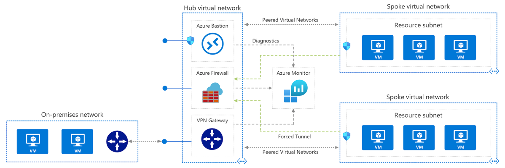

## Azure Networking

Azure networking components offer a range of functionalities and services.

- Virtual Network. Create a logically isolated section in Microsoft Azure and securely connect is outward.
- Load Balancer. A load balancer that distributes incoming traffic among backen virtual machines instances.
- Application Gateway. Scalable layer-7 load balancer offering various traffic routing rules and SSL termination for backend
- Trafffic Manager profile. Allos you to control the distribution of user.
- Virtual network gateway. The VPN device in your Azure virtual network and used with site-to-site and VNet-to-VNet VPN
- Virtual WAN. Networking service that provides optimized and automated branch-to-branch
  
## Azure Virtual Network (VNet)

Virtual networks can be used in many ways.

- **Create a dedicated private cloud-only VNet.** Sometimes you don't require a cross-premises configuration for your solution. When you create a VNet, your services and VMs within your VNet can communicate directly and securely with each other in the cloud. You can still configure endpoint connections for the VMs and services that require internet communication, as part of your solution.
- **Securely extend your data center With VNets.** You can build traditional site-to-site (S2S) VPNs to securely scale your datacenter capacity. S2S VPNs use IPSEC to provide a secure connection between your corporate VPN gateway and Azure.
- **Enable hybrid cloud scenarios.** VNets give you the flexibility to support a range of hybrid cloud scenarios. You can securely connect cloud-based applications to any type of on-premises system such as mainframes and Unix systems.

By default, you can create up to 50 virtual networks per subscription per network. You can increase this limit to 500 by contacting Azure support.

### Subnets

A virtual network can be segmented into one or more subnets. Subnets provide logical divisions within your network. Subnets can help improve security, increase performance, and make it easier to manage the network.

- **Service requirements.** Each service directly deployed into virtual network has specific requirements for routing and the types of traffic that must be allowed into and out of subnets. A service may require, or create, their own subnet, so there must be enough unallocated space for them to do so. For example, if you connect a virtual network to an on-premises network using an Azure VPN Gateway, the virtual network must have a dedicated subnet for the gateway.
- **Virtual appliances.** Azure routes network traffic between all subnets in a virtual network, by default. You can override Azure's default routing to prevent Azure routing between subnets, or to route traffic between subnets through a network virtual appliance. So, if you require that traffic between resources in the same virtual network flow through a network virtual appliance (NVA), deploy the resources to different subnets.
- **Service endpoints.** You can limit access to Azure resources such as an Azure storage account or Azure SQL database, to specific subnets with a virtual network service endpoint. Further, you can deny access to the resources from the internet. You may create multiple subnets, and enable a service endpoint for some subnets, but not others.
- **Network security groups.** You can associate zero or one network security group to each subnet in a virtual network. You can associate the same, or a different, network security group to each subnet. Each network security group contains rules, which allow or deny traffic to and from sources and destinations.

---
Note

There are restrictions on using IP addresses. Azure reserves five IP addresses within each subnet.

- x.x.x.0: Network address
- x.x.x.1: Reserved by Azure for the default gateway
- x.x.x.[2,3]: Reserved by Azure to map the Azure DNS IPs to the VNet space
- x.x.x.255: Network broadcast address.

---

### Plan IP addressing

You can assign IP addresses to Azure resources to communicate with other Azure resources, your on-premises network, and the Internet. There are two types of Azure IP addresses: public and private IP addresses.

#### Private IP addresses

Used for communication within an Azure virtual network (VNet), and your on-premises network, when you use a VPN gateway or ExpressRoute circuit to extend your network to Azure.

A private IP address resource can be associated with virtual machine network interfaces, internal load balancers, and application gateways. Azure can provide an IP address (dynamic assignment) or you can assign the IP address (static assignment).

| Private IP addresses | IP address association | Dynamic | Static
| - | - | - | - |
| Virtual Machine | NIC | Yes | Yes
| Internal Load Balancer | Front-end configuration | Yes | Yes
| Application Gateway | Front-end configuration | Yes | Yes

#### Public IP addresses 

Used for communication with the Internet, including Azure public-facing services.

A public IP address resource can be associated with virtual machine network interfaces, internet-facing load balancers, VPN gateways, and application gateways.

| Public IP addresses | IP address association | Dynamic | Static
| - | - | - | - |
| Virtual Machine | NIC | Yes | Yes
| Load Balancer | Front-end configuration | Yes | Yes
| VPN Gateway | Gateway IP configuration | Yes | Yes*
| Application Gateway | Front-end configuration | Yes | Yes*

\* Static IP addresses only available on certain SKUs.

**Address SKUs**

When you create a public IP address, you are given a SKU choice of either Basic or Standard. Your SKU choice affects the IP assignment method, security, available resources, and redundancy. This table summarizes the differences.

| Feature | Basic SKU | Standard SKU
| - | - | - |
| IP assignment | Static or Dynamic | Static
| Security | Open by default | Are secure by default and closed inbound traffic
| Resources | NICs, VPN Gateways, Application Gateways, and Internet facing load balancers | NICs or public standard load balancers
| Redundancy | Not redundant | Zone redundant by default

### Static vs dynamic addressing

IP addresses can also be statically assigned or dynamically assigned. Static IP addresses do not change and are best for certain situations such as:

- DNS name resolution, where a change in the IP address would require updating host records.
- IP address-based security models that require apps or services to have a static IP address.
- TLS/SSL certificates linked to an IP address.
- Firewall rules that allow or deny traffic using IP address ranges.
- Role-based VMs such as Domain Controllers and DNS servers.

## Network Security Rules (NSG)

You can limit network traffic to resources in a virtual network using a network security group (NSG). A network security group contains a list of security rules that allow or deny inbound or outbound network traffic. An NSG can be associated to a subnet or a network interface. A network security group can be associated multiple times.

Security rules in network security groups enable you to filter the type of network traffic that can flow in and out of virtual network subnets and network interfaces. Azure creates several default security rules within each network security group.

You can add more rules by specifying:

- Name
- Priority
- Port
- Protocol (Any, TCP, UDP)
- Source (Any, IP Addresses, Service tag)
- Destination (Any, IP Addresses, - Virtual Network)
- Action (Allow or Deny)

Azure creates the default rules in each network security group that you create. You cannot remove the default rules, but you can override them by creating rules with higher priorities.

**Service.** Service specifies the destination protocol and port range for this rule. You can choose a predefined service, like HTTPS and SSH. When you select a service, the Port range is automatically completed. Choose custom to provide your own port range.

**Port ranges.** Port ranges can include a single port, a port range, or a comma-separated list of ports. The ports designate the traffic will be allowed or denied by this rule. Provide an asterisk (*) to allow traffic on any port.

**Priority.** Rules are processed in priority order. The lower the number, the higher the priority. We recommend leaving gaps between rules to make it easier to add new rules. The value is between 100-4096 and unique for all security rules within the network security group.

#### Default Inbound rules

- AllowVnetInBound (65000)
- AllowAzureLoadBalancerInBound (65001)
- DenyAllInBound (65500)

#### Default Outbound rules

- AllowVnetOutBound (65000)
- AllowInternetOutBound (65001)
- DenyAllOutBound (65500)

#### Determine network security group effective rules

NSGs are evaluated independently, and an “allow” rule must exist at both levels otherwise traffic will not be allowed.

[Example and details here](https://docs.microsoft.com/en-gb/learn/modules/configure-network-security-groups/4-determine-network-security-groups-effective-rules)

### NSG on Subnets

You can assign NSGs to subnets and create protected screened subnets (also called a DMZ). These NSGs can restrict traffic flow to all the machines that reside within that subnet. Each subnet can have zero, or one, associated network security groups.

### NSG on NICs

You can assign NSGs to a NIC so that all the traffic that flows through that NIC is controlled by NSG rules. Each network interface that exists in a subnet can have zero, or one, associated network security groups.

## Azure Firewall

Azure Firewall is a managed, cloud-based network security service that protects your Azure Virtual Network resources. It's a fully stateful firewall as a service with built-in high availability and unrestricted cloud scalability. You can centrally create, enforce, and log application and network connectivity policies across subscriptions and virtual networks.

Azure Firewall uses a static public IP address for your virtual network resources allowing outside firewalls to identify traffic originating from your virtual network. The service is fully integrated with Azure Monitor for logging and analytics

- **Built-in high availability.** High availability is built in, so additional load balancers aren't required. There's nothing you need to configure.
- **Availability Zones.** Azure Firewall can be configured during deployment to span multiple Availability Zones for increased availability.
- **Unrestricted cloud scalability.** Azure Firewall can scale up as much as you need to accommodate changing network traffic flows, so you don't need to budget for your peak traffic.
- **Application FQDN filtering rules.** You can limit outbound HTTP/S traffic or Azure SQL traffic to a specified list of fully qualified domain names (FQDN) including wild cards.
- **Network traffic filtering rules.** You can centrally create allow or deny network filtering rules by source and destination IP address, port, and protocol. Azure Firewall is fully stateful, so it can distinguish legitimate packets for different types of connections. Rules are enforced and logged across multiple subscriptions and virtual networks.
- **Threat intelligence.** Threat intelligence-based filtering can be enabled for your firewall to alert and deny traffic from/to known malicious IP addresses and domains. The IP addresses and domains are sourced from the Microsoft Threat Intelligence feed.
- **Multiple public IP addresses.** You can associate multiple public IP addresses with your firewall.

It's recommended to use a hub-spoke network topology when deploying a firewall.

- The hub is a virtual network in Azure that acts as a central point of connectivity to your on-premises network.
- The spokes are virtual networks that peer with the hub, and can be used to isolate workloads.
- Traffic flows between the on-premises datacenter and the hub through an ExpressRoute or VPN gateway connection.

The benefits of this topology include:

- Cost savings by centralizing services that can be shared by multiple workloads, such as network virtual appliances (NVAs) and DNS servers, in a single location.
- Overcome subscriptions limits by peering virtual networks from different subscriptions to the central hub.
- Separation of concerns between central IT (SecOps, InfraOps) and workloads (DevOps).

Typical uses for a hub-spoke network architecture include:

- Workloads in different environments that require shared services. For example, development and testing environments that require DNS. Shared services are placed in the hub virtual network. Each environment is deployed to a spoke to maintain isolation.
- Workloads that don't require connectivity to each other, but require access to shared services.
- Enterprises that require central control over security aspects. For example, a firewall in the hub and workloads in each spoke.

### Firewall rules

There are three kinds of rules that you can configure in the Azure Firewall. Remember, by default, Azure Firewall blocks all traffic, unless you enable it.

#### NAT rules

You can configure Azure Firewall Destination Network Address Translation (DNAT) to translate and filter inbound traffic to your subnets. Each rule in the NAT rule collection is used to translate your firewall public IP and port to a private IP and port. Scenarios where NAT rules might be helpful are publishing SSH, RDP, or non-HTTP/S applications to the Internet. A NAT rule that routes traffic must be accompanied by a matching network rule to allow the traffic. Configuration settings include:

- **Name:** A label for the rule.
- **Protocol:** TCP or UDP.
- **Source Address:** * (Internet), a specific Internet address, or a CIDR block.
- **Destination Address:** The external address of the firewall that the rule will inspect.
- **Destination Ports:** The TCP or UDP ports that the rule will listen to on the external IP address of the firewall.
- **Translated Address:** The IP address of the service (virtual machine, internal load balancer, and so on) that privately hosts or presents the service.
- **Translated Port:** The port that the inbound traffic will be routed to by the Azure Firewall.

#### Network rules

Any non-HTTP/S traffic that will be allowed to flow through the firewall must have a network rule. For example, if resources in one subnet must communicate with resources in another subnet, then you would configure a network rule from the source to the destination. Configuration settings include:

- **Name:** A friendly label for the rule.
- **Protocol:** TCP, UDP, ICMP (ping and traceroute) or Any.
Source Address: The address or CIDR block of the source.
- **Destination Addresses:** The addresses or CIDR blocks of the destination(s).
- **Destination Ports:** The destination port of the traffic.

#### Application rules

Application rules define fully qualified domain names (FQDNs) that can be accessed from a subnet. For example, specify the Windows Update network traffic through the firewall. Configuration settings include:

- **Name:** A friendly label for the rule.
- **Source Addresses:** The IP address of the source.
- **Protocol:Port:** HTTP/HTTPS and the port that the web server is listening on.
- **Target FQDNs:** The domain name of the service, such as www.contoso.com. Wildcards can be used. An FQDN tag represents a group of FQDNs associated with well known Microsoft services. Example FQDN tags include Windows Update, App Service Environment, and Azure Backup.

#### Rule processing

When a packet is being inspected to determine if it is allowed or not, the rules are processed in this order:

Network Rules
Application Rules (network and application)
Once a rule is found that allows the traffic through, no more rules are checked.

## Azure DNS

