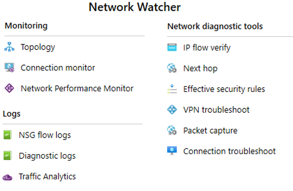

# Azure Network Watcher

Network Watcher provides tools to monitor, diagnose, view metrics, and enable or disable logs for resources in an Azure virtual network. Network Watcher is a regional service that enables you to monitor and diagnose conditions at a network scenario level.

- **Automate remote network monitoring with packet capture.** Monitor and diagnose networking issues without logging in to your virtual machines (VMs) using Network Watcher. Trigger packet capture by setting alerts, and gain access to real-time performance information at the packet level. When you observe an issue, you can investigate in detail for better diagnoses.
- **Gain insight into your network traffic using flow logs.** Build a deeper understanding of your network traffic pattern using Network Security Group flow logs. Information provided by flow logs helps you gather data for compliance, auditing and monitoring your network security profile.
- **Diagnose VPN connectivity issues.** Network Watcher provides you the ability to diagnose your most common VPN Gateway and Connections issues. Allowing you, not only, to identify the issue but also to use the detailed logs created to help further investigate.

more details [here](https://docs.microsoft.com/en-gb/learn/modules/configure-network-watcher/2-describe-features)