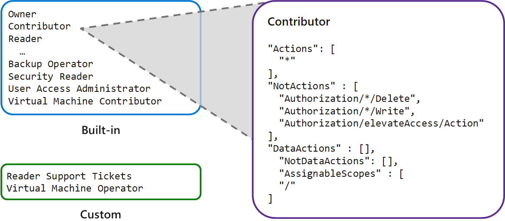
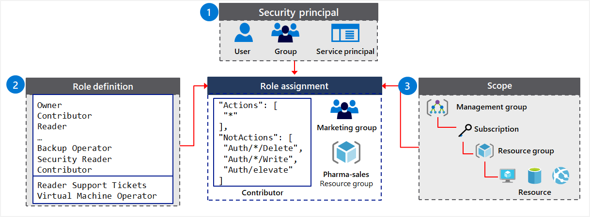
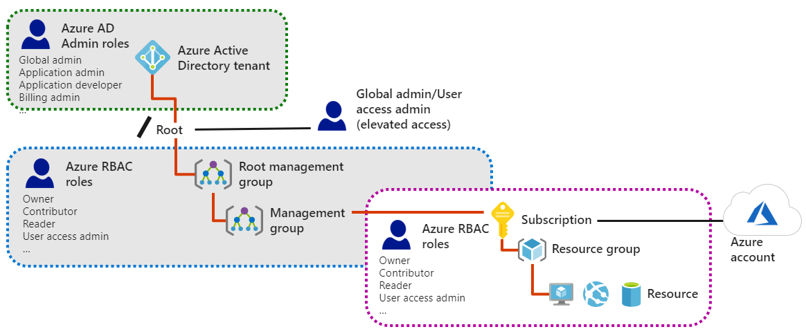

- [Manage Identifies and Governance in Azure](#manage-identifies-and-governance-in-azure)
  - [User Accounts](#user-accounts)
    - [Manage User Accounts](#manage-user-accounts)
      - [Permissions and roles](#permissions-and-roles)
      - [Create bulk user accounts](#create-bulk-user-accounts)
    - [Create group accounts](#create-group-accounts)
      - [Access rights through single user or group assigment](#access-rights-through-single-user-or-group-assigment)
    - [Adding members to groups](#adding-members-to-groups)
    - [Create administrative units](#create-administrative-units)
      - [Example for using administrative units](#example-for-using-administrative-units)
      - [Considerations](#considerations)
  - [Subscriptions](#subscriptions)
    - [Azure accounts](#azure-accounts)
    - [Types of Subscriptions](#types-of-subscriptions)
    - [Plan and control expenses](#plan-and-control-expenses)
    - [Apply resource tagging](#apply-resource-tagging)
    - [Apply cost savings](#apply-cost-savings)
  - [Azure Policy](#azure-policy)
    - [Management Groups](#management-groups)
      - [Adding management groups](#adding-management-groups)
    - [Implement Azure policies](#implement-azure-policies)
      - [Create Azure policies](#create-azure-policies)
      - [Create policy definitions](#create-policy-definitions)
      - [Create initiative definitions](#create-initiative-definitions)
      - [Scope the initiative definition](#scope-the-initiative-definition)
      - [Determine compliance](#determine-compliance)
  - [Role-based access control](#role-based-access-control)
    - [Overview of Role-based access control](#overview-of-role-based-access-control)
      - [Examples of what can you do with Azure roles](#examples-of-what-can-you-do-with-azure-roles)
      - [Concepts](#concepts)
      - [Considerations](#considerations-1)
      - [How does Azure RBAC work?](#how-does-azure-rbac-work)
    - [Create a role definition](#create-a-role-definition)
      - [Actions and NotActions](#actions-and-notactions)
      - [Scope your role](#scope-your-role)
    - [Create a role assignment](#create-a-role-assignment)
    - [Compare Azure roles to Azure Active Directory roles](#compare-azure-roles-to-azure-active-directory-roles)
    - [Apply role-based access control](#apply-role-based-access-control)
    - [Determine role-based access control roles](#determine-role-based-access-control-roles)
      - [Other things to know](#other-things-to-know)
      - [Azure RBAC is an allow model](#azure-rbac-is-an-allow-model)
    - [Self-Service password reset (SSPR) in Azure Active Directory](#self-service-password-reset-sspr-in-azure-active-directory)
      - [How SSPR works](#how-sspr-works)
      - [Authenticate a password reset](#authenticate-a-password-reset)
      - [Require teh minimum number of authentication methods](#require-teh-minimum-number-of-authentication-methods)
      - [Recommendations SSPR](#recommendations-sspr)
      - [Accounts associated with administrator roles](#accounts-associated-with-administrator-roles)
      - [Configure notifications](#configure-notifications)
      - [License requirements](#license-requirements)
# Manage Identifies and Governance in Azure

## User Accounts

Typically, Azure AD defines users in three ways:

- **Cloud identities.** These users exist only in Azure AD. Examples are administrator accounts and users that you manage yourself. Cloud identities can be in Azure Active Directory or an external Azure Active Directory, if the user is defined in another Azure AD instance. When these accounts are removed from the primary directory, they are deleted.
- **Directory-synchronized identities.** These users exist in an on-premises Active Directory. A synchronization activity that occurs via Azure AD Connect brings these users in to Azure. Their source is Windows Server AD.
- **Guest users.** These users exist outside Azure. Examples are accounts from other cloud providers and Microsoft accounts such as an Xbox LIVE account. Their source is Invited user. This type of account is useful when external vendors or contractors need access to your Azure resources. Once their help is no longer necessary, you can remove the account and all of their access.

### Manage User Accounts

- **Portal** You can add new users through the Azure portal. In addition to Name and User name, there is profile information like Job Title and Department.
- **Microsoft 365 Admin Center**.
- **Microsoft Intune admin console**.
- **Azure CLI.**

[tutorials](https://docs.microsoft.com/en-gb/learn/modules/create-users-and-groups-in-azure-active-directory/2-user-accounts-azure-ad)

#### Permissions and roles

There are different types of user accounts in Azure AD. Each type has a level of access specific to the scope of work expected to be done under each type of user account. Administrators have the highest level of access, followed by the member user accounts in the Azure AD organization. Guest users have the most restricted level of access.

|Role | Description |
| - | - |
| Administrator roles | Administrator roles in Azure AD allow users elevated access to control who is allowed to do what. You assign these roles to a limited group of users to manage identity tasks in an Azure AD organization. You can assign administrator roles that allow a user to create or edit users, assign administrative roles to others, reset user passwords, manage user licenses, and more.
| Member users | A member user account is a native member of the Azure AD organization that has a set of default permissions like being able to manage their profile information. When someone new joins your organization, they typically have this type of account created for them. Anyone who isn't a guest user or isn't assigned an administrator role falls into this type. A member user is meant for users who are considered internal to an organization and are members of the Azure AD organization. However, these users shouldn't be able to manage other users by, for example, creating and deleting users. Member users don't have the same restrictions that are typically placed on guest users.
| Guest users | Guest users have restricted Azure AD organization permissions. When you invite someone to collaborate with your organization, you add them to your Azure AD organization as a guest user. Then you can either send an invitation email that contains a redemption link or send a direct link to an app you want to share. Guest users sign in with their own work, school, or social identities. By default, Azure AD member users can invite guest users. This default can be disabled by someone who has the User Administrator role.

Your organization might need to work with an external partner. To collaborate with your organization, these partners often need to have a certain level of access to specific resources. For this sort of situation, it's a good idea to use guest user accounts. You'll then make sure partners have the right level of access to do their work, without having a higher level of access than they need.


#### Create bulk user accounts

Azure Active Directory (Azure AD) supports bulk user create and delete operations and supports downloading lists of users. Just fill out the comma-separated values (CSV) template. You can download the template from the Azure AD portal. To create users in the Azure portal, you must be signed in as a Global administrator or User administrator.

Consider:

- **Naming conventions**. Ex. last name, first name + @domain
- **Passswords.** mplement a convention for the initial password of the newly created user. Figure out a way for the new users to receive their password in a secure way. Methods commonly used include generating a random password and emailing it to the new user or their manager.

---
**Note**

PowerShell is also available for buld user uploads.

---

### Create group accounts

Azure AD allows you to define two different types of groups.

- **Security groups.** Security groups are used to manage member and computer access to shared resources for a group of users. For example, you can create a security group for a specific security policy. By doing it this way, you can give a set of permissions to all the members at once, instead of having to add permissions to each member individually. This option requires an Azure AD administrator.
- **Microsoft 365 groups.** Microsoft 365 groups provide collaboration opportunities by giving members access to a shared mailbox, calendar, files, SharePoint site, and more. You can give people outside of your organization access to the group. Both users and admins can use Microsoft 365 groups.

#### Access rights through single user or group assigment

Azure AD helps you provide access rights to a single user or to an entire group of users. You can assign a set of access permissions to all the members of the group. Access permissions range from full access to the ability to create or remove resources.

There are different ways you can assign access rights:

- **Direct assignment:** Assign a user the required access rights by directly assigning a role that has those access rights.
- **Group assignment:** Assign a group the required access rights, and members of the group will inherit those rights.
- **Rule-based assignment:** Use rules to determine a group membership based on user or device properties. For a user account or device's group membership to be valid, the user or device must meet the rules. If the rules aren't met, the user account or device's group membership is no longer valid. The rules can be simple. You can select prewritten rules or write your own advanced rules.

### Adding members to groups

There are different ways you can assign access rights:

- **Assigned.** Lets you add specific users to be members of this group and to have unique permissions
- **Dynamic User.** Lets you use dynamic membership rules to automatically add and remove members. When a member's attributes change, Azure reviews the dynamic group rules for the directory. If the member meets the rule requirements, they're added. If the member no longer meets the rules requirements, they're removed.
- **Dynamic Device (Secure groups only).** Lets you use dynamic group rules to automatically add and remove devices. If a device's attributes change, Azure reviews the dynamic group rules for the directory. If the device meets the rule requirements, they're added. If the device no longer meets the rules requirements, they're removed.

### Create administrative units

It can be useful to restrict administrative scope by using administrative units in organizations that are made up of independent divisions of any kind.

#### Example for using administrative units

Consider the example of a large university that's made up of many autonomous schools (School of Business, School of Engineering, and so on). Each school has a team of IT admins who control access, manage users, and set policies for their school.

A central administrator could:

- Create a role with administrative permissions over only Azure AD users in the business school administrative unit.
- Create an administrative unit for the School of Business.
- Populate the administrative unit with only the business school students and staff.
- Add the business school IT team to the role, along with its scope.

#### Considerations

- You can mange administrative units by using the Azure portal, PowerShell cmdlets and scripts, or Microsoft Graph.
- In the portal, you can manage administrative units if you are a Global Administrator or a Privileged Role Administrator.
- Administrative units apply scope only to management permissions. They don't prevent members or administrators from using their default use permissions to browse other users, groups, or resources outside the adminstrative unit.

## Subscriptions

An Azure subscription is a logical unit of Azure services that is linked to an Azure account. Billing for Azure services is done on a per-subscription basis. If your account is the only account associated with a subscription, then you are responsible for billing.

### Azure accounts

Subscriptions have accounts. An Azure account is simply an identity in Azure Active Directory (Azure AD) or in a directory that is trusted by Azure AD, such as a work or school organization. If you don't belong to one of these organizations, you can sign up for an Azure account by using your Microsoft Account, which is also trusted by Azure AD.

Every Azure subscription is associated with an Azure Active Directory. Users and services that access resources of the subscription first need to authenticate with Azure Active Directory.

### Types of Subscriptions

Azure offers free and paid subscription options to suit different needs and requirements. The most commonly used subscriptions are:

- Free
- Pay-As-You-Go
- Enterprise Agreement
- Student

### Plan and control expenses

The ways that Cost Management help you plan for and control your costs include: Cost analysis, budgets, recommendations, and exporting cost management data.

- **Cost analysis.** You use cost analysis to explore and analyze your organizational costs. You can view aggregated costs by organization to understand where costs are accrued and to identify spending trends. And you can see accumulated costs over time to estimate monthly, quarterly, or even yearly cost trends against a budget.

- **Budgets.** Budgets help you plan for and meet financial accountability in your organization. They help prevent cost thresholds or limits from being surpassed. Budgets can also help you inform others about their spending to proactively manage costs. And with them, you can see how spending progresses over time.

- **Recommendations.** Recommendations show how you can optimize and improve efficiency by identifying idle and underutilized resources. Or, they can show less expensive resource options. When you act on the recommendations, you change the way you use your resources to save money. To act, you first view cost optimization recommendations to view potential usage inefficiencies. Next, you act on a recommendation to modify your Azure resource use to a more cost-effective option. Then you verify the action to make sure that the change you make is successful.

- **Exporting cost management data.** If you use external systems to access or review cost management data, you can easily export the data from Azure. And you can set a daily scheduled export in CSV format and store the data files in Azure storage. Then, you can access the data from your external system.

### Apply resource tagging

You can apply tags to your Azure resources to logically organize them by categories. Each tag consists of a name and a value. For example, you can apply the name Environment and the value Production or Development to your resources. After creating your tags, you associate them with the appropriate resources.

With tags in place, you can retrieve all the resources in your subscription with that tag name and value. This means, you can retrieve related resources from different resource groups.

There are a few things to remember about tagging:

- Each resource or resource group can have a maximum of 50 tag name/value pairs.
- Tags applied to the resource group are not inherited by the resources in that resource group.

### Apply cost savings

- **Reservations** help you save money by paying ahead. You can pay for one-year or three-years of virtual machine, SQL Database compute capacity, Azure Cosmos DB throughput, or other Azure resources. Pre-paying allows you to get a discount on the resources you use. Reservations can significantly reduce your virtual machine, SQL database compute, Azure Cosmos DB, or other resource costs up to 72% on pay-as-you-go prices. Reservations provide a billing discount and don't affect the runtime state of your resources.

- **Azure Hybrid Benefits** is a pricing benefit for customers who have licenses with Software Assurance. Azure Hybrid Benefits helps maximize the value of existing on-premises Windows Server or SQL Server license investments when migrating to Azure. There's an Azure Hybrid Benefit Savings Calculator to help you determine your savings.

- **Azure Credits** is monthly credit benefit that allows you to experiment with, develop, and test new solutions on Azure. For example, as a Visual Studio subscriber, you can use Microsoft Azure at no extra charge. With your monthly Azure credit, Azure is your personal sandbox for dev/test.

Azure regions pricing can vary from one region to another, even in the US. Double check the pricing in various regions to see if you can save a little.

Budgets help you plan for and drive organizational accountability. With budgets, you can account for the Azure services you consume or subscribe to during a specific period. They help you inform others about their spending to proactively manage costs, and to monitor how spending progresses over time. When the budget thresholds you've created are exceeded, only notifications are triggered. None of your resources are affected and your consumption isn't stopped. You can use budgets to compare and track spending as you analyze costs.

Pricing Calculator:

The Pricing Calculator provides estimates in all areas of Azure including compute, networking, storage, web, and databases.

## [Azure Policy](https://docs.microsoft.com/en-gb/learn/modules/configure-azure-policy/4-create-azure-policies)

### Management Groups

If your organization has several subscriptions, you may need a way to efficiently manage access, policies, and compliance for those subscriptions. Azure management groups provide a level of scope above subscriptions. You organize subscriptions into containers called management groups and apply your governance conditions to the management groups. Management group enable:

- Organizational alignment for your Azure subscriptions through custom hierarchies and grouping.
- Targeting of policies and spend budgets across subscriptions and inheritance down the hierarchies.
- Compliance and cost reporting by organization (business/teams).

All subscriptions within a management group automatically inherit the conditions applied to the management group. For example, you can apply policies to a management group that limits the regions available for virtual machine (VM) creation. This policy would be applied to all management groups, subscriptions, and resources under that management group by only allowing VMs to be created in that region.

#### Adding management groups

You can create the management group by using the portal, PowerShell, or Azure CLI.

- The **Management Group ID** is the directory unique identifier that is used to submit commands on this management group. This identifier is not editable after the creationg as it is used throughout the Azure system to identify this group.
- **The Display Name** field is the name that is displayed within the Azure Portal. A separate display name is an optional field when creating the management group and can be changed at any time.

### Implement Azure policies

Azure Policy is a service in Azure that you use to create, assign, and manage policies. These policies enforce different rules over your resources, so those resources stay compliant with your corporate standards and service level agreements. Azure Policy runs evaluations and scans for resources that are not compliant.

The main advantages of Azure policy are in the areas of enforcement and compliance, scaling, and remediation.

- **Enforcement and compliance.** Turn on built-in policies or build custom ones for all resource types. Real-time policy evaluation and enforcement. Periodic and on-demand compliance evaluation.
- **Apply policies at scale.** Apply policies to a Management Group with control across your entire organization. Apply multiple policies and aggregate policy states with policy initiative. Define an exclusion scope.
- **Remediation.** Real-time remediation, and remediation on existing resources.
  
Azure Policy will be important to you if your team runs an environment where you need to govern:

- Multiple engineering teams (deploying to and operating in the environment)
- Multiple subscriptions
- Need to standardize/enforce how cloud resources are configured
- Manage regulatory compliance, cost control, security, or design consistency

**Use cases**

- Specify the resource types that your organization can deploy.
- Specify a set of virtual machine SKUs that your organization can deploy.
- Restrict the locations your organization can specify when deploying resources.
- Enforce a required tag and its value.
- Audit if Azure Backup service is enabled for all Virtual machines.

#### Create Azure policies

To implement Azure Policies, you can follow these steps.

1. **Browse Policy Definitions.** A Policy Definition expresses what to evaluate and what actions to take. Every policy definition has conditions under which it is enforced. And, it has an accompanying effect that takes place if the conditions are met. For example, you could prevent VMs from being deployed if they are exposed to a public IP address.
1. **Create Initiative Definitions.** An initiative definition is a set of Policy Definitions to help track your compliance state for a larger goal. For example, ensuring a branch office is compliant.
1. **Scope the Initiative Definition.** You can limit the scope of the Initiative Definition to Management Groups, Subscriptions, or Resource Groups.
1. **View Policy Evaluation results.** Once an Initiative Definition is assigned, you can evaluate the state of compliance for all your resources. Individual resources, resource groups, and subscriptions within a scope can be exempted from having policy rules affect it. Exclusions are handled individually for each assignment.

#### Create policy definitions

There are many Built-in Policy Definitions for you to choose from. Sorting by Category will help you locate what you need. For example,

- The Allowed Virtual Machine SKUs enables you to specify a set of virtual machine SKUs that your organization can deploy.
- The Allowed Locations policy enables you to restrict the locations that your organization can specify when deploying resources. The Allowed Locations policy can be used to enforce your geo-compliance requirements.

When there isn't an applicable policy you can add a new Policy Definition. You can import a policy definitions from [GitHub](https://github.com/Azure/azure-policy/tree/master/samples). New Policy Definitions are added almost every day.

#### Create initiative definitions

Once you have determined which Policy Definitions you need, you create an Initiative Definition. This definition will include one or more policies. There is a pick list on the right side of the New Initiative definition page (not shown) to make your selection.

#### Scope the initiative definition

Once our Initiative Definition is created, you can assign the definition to establish its scope. A scope determines what resources or grouping of resources the policy assignment gets enforced on.

#### Determine compliance

Once your policy is in place, you can use the Compliance blade to review non-compliant initiatives, non-compliant policies, and non-compliant resources.

Policy conditions are evaluated against your existing resources. Although the portal does not show the evaluation logic, the compliance state results are shown. The compliance state result is either compliant or non-compliant.

## Role-based access control

### Overview of Role-based access control

Securing your Azure resources, such as virtual machines, websites, networks, and storage, is a critical function for any organization using the cloud. Your company wants to ensure that your data and assets are protected, but still grant your employees and partners the access they need to perform their jobs.

You decide to use role-based access control. You need to ensure assets are protected, but users can still access the resources they need.

Access management for cloud resources is a critical function for any organization that is using the cloud. Role-based access control (RBAC) helps you manage who has access to Azure resources, what they can do with those resources, and what areas they have access to.

Azure RBAC is an authorization system built on Azure Resource Manager that provides fine-grained access management of resources in Azure.


#### Examples of what can you do with Azure roles

Here are some examples of what you can do with Azure RBAC:

- Allow an application to access all resources in a resource group
- Allow one user to manage virtual machines in a subscription and another user to manage virtual networks
- Allow a DBA group to manage SQL databases in a subscription
- Allow a user to manage all resources in a resource group, such as virtual machines, websites, and subnets

#### Concepts

- **Security principal.** Object that represents something that is requesting access to resources. Examples: user, group, service principal, managed identity

- **Role definition.** Collection of permissions that lists the operations that can be performed. Examples: Reader, Contributor, Owner, User Access Administrator

-**Scope.** Boundary for the level of access that is requested. Examples: management group, subscription, resource group, resource

-**Assignment.** Attaching a role definition to a security principal at a particular scope. Users can grant access described in a role definition by creating an assignment. Deny assignments are currently read-only and can only be set by Azure.

#### Considerations

Using Azure RBAC, you can segregate duties within your team and grant only the amount of access to users that they need to perform their jobs. Instead of giving everybody unrestricted permissions in your Azure subscription or resources, you can allow only certain actions at a particular scope.

When planning your access control strategy, it's a best practice to grant users the least privilege to get their work done.

#### How does Azure RBAC work?

You control access to resources using Azure RBAC by creating role assignments, which control how permissions are enforced. To create a role assignment, you need three elements: a security principal, a role definition, and a scope. You can think of these elements as "who", "what", and "where".

1. Security principal (who)
1. Role definition (what you can do)
1. Scope (where)


### Create a role definition

Each role is a set of properties defined in a JSON file. This role definition includes Name, Id, and Description. The definition also includes the allowable permissions (Actions), denied permissions (NotActions), and scope (read access, etc.) for the role.



#### Actions and NotActions

The Actions and NotActions properties can be tailored to grant and deny the exact permissions you need. this table defines how the Owner, Contributor, and Reader roles.

| Built-in Role | Action | NotActions |
| - | - | - |
|Owner (allow all actions)| * | |
|Contributor (allow all actions exept writing or deleting role assignment)|* | Microsoft.Authorization/*/Delete, Microsoft.Authorization/*/Write, Microsoft.Authorization/*/elevateAccess/Action |
|Reader (allow all read actions)| */read | 

#### Scope your role

After denining the Actions and NotActions, you must scope the role.

The AssignableScopes property of the role specifies the role scope. The scope can be subscriptions, resource groups, or resources.

Example:

```json
* /subscriptions/[subscription id]
* /subscriptions/[subscription id]/resourceGroupts/[resource group name]
* /subscriptions/[subscription id]/resourceGroupts/[resource group name]/[resource]
```
### Create a role assignment

A role assignment is the process of scoping a role definition to a user, group, service principal, or managed identity. The purpose of the role assignment is to grant access. Access is revoked by removing a role assignment.

For example, in the diagram, the Marketing group has been assigned the Contributor role for the pharma-sales resource group. Users in the Marketing group can create or manage any Azure resource in the pharma-sales resource group. Marketing users don't have access to resources outside the pharma-sales resource group, unless they are part of another role assignment.



<span stype="color:red">---
Note

A resource inherits role assignments from its parent resource.

---</span>

### Compare Azure roles to Azure Active Directory roles

At a high level, Azure RBAC roles control permissions to manage Azure resources, while Azure AD administrator roles control permissions to manage Azure Active Directory resources. The following table compares some of the differences.

|Azure RBAC roles|Azure AD roles|
| - | - |
|Manage access to Azure resources. | Manage access to Azure Active Directory resources.
|Scope can be specified at multiple levels (management group, subacription, resource group, resource)| Scope is at the tenant level
| Role information can be accessed in Azure portal, Azure CLI, Azure PowerShell, Azure Resource Manager templates, REST API.| Role information can be accessed in Azure admin portal, Microsoft 365 admin portal, Microsoft Graph AzureAD PowerShell.

<span stype="color:red">---
Note

Azure Resource Manager roles should be used instead of Classic administrator roles.

---</span>

### Apply role-based access control

RBAC includes many built-in roles, can be assigned at different scopes, and allows you to create your own custom roles. To manage resources in Azure AD, such as users, groups, and domains, there are several Azure AD administrator roles.

The following diagram illustrates how Azure AD Admin roles are different from Azure RBAC roles. Azure AD Admin roles are used to manage resources in Azure AD, such as users, groups, and domains. Azure RBAC roles provide more fine-grained access management to Azure resources.



### Determine role-based access control roles

Azure includes several built-in roles that you can use. There are four fundamental built-in roles. The first three apply to all resource types.

- **Owner.** Has full access to all resources including the right to delegate access to others. The Service Administrator and Co-Administrators are assigned the Owner role at the subscription scope.
- **Contributor.** Can create and manage all types of Azure resources but can’t grant access to others.
- **Reader.** Can view existing Azure resources.
- **User Access Administrator.** Lets you manage user access to Azure resources, rather than to managing resources.

#### Other things to know

- There are other built-in roles. For example, the Virtual Machine Contributor role allows a user to create and manage virtual machines.
- When the built-in roles don't meet the specific needs of your organization, you can create your own custom roles.
- Roles can grant access to data within an object. For example, if a user has read data access to a storage account, then they can read the blobs or messages in the storage account.

#### Azure RBAC is an allow model

Azure RBAC is an allow model. What this means is that when you are assigned a role, Azure RBAC allows you to perform certain actions, such as read, write, or delete. So, if one role assignment grants you read permissions to a resource group and a different role assignment grants you write permissions to the same resource group, you will have read and write permissions on that resource group.

### Self-Service password reset (SSPR) in Azure Active Directory

#### How SSPR works

The user initiates a password reset either by going directly to the password reset portal or by selecting the Can't access your account link on a sign-in page. The reset portal takes these steps:

1. Localization: The portal checks the browser's locale setting and renders the SSPR page in the appropriate language.
1. Verification: The user enters their username and passes a captcha to ensure that it's a user and not a bot.
1. Authentication: The user enters the required data to authenticate their identity. They might, for example, enter a code or answer security questions.
1. Password reset: If the user passes the authentication tests, they can enter a new password and confirm it.
1. Notification: A message is usually sent to the user to confirm the reset.

There are several ways you can customize the SSPR user experience. For example, you can add your company logo to the sign-in page so users know that they're in the right place to reset their password.

#### Authenticate a password reset

It's critical to verify the identity of a user before you allow a password reset. Malicious users might exploit any weakness in the system to impersonate that user. Azure supports six different ways to authenticate reset requests.

As an administrator, you choose the methods to use when you configure SSPR. Enable two or more of these methods so that users can choose the ones that they can use easily. The methods are:

| Authentication method | How to register | How to authenticate for a password reset
| - | - | - |
| Mobile app notification | nstall the Microsoft Authenticator app on your mobile device, and then register it on the multifactor authentication setup page.| Azure sends a notification to the app, which you can either verify or deny.
| Mobile app code | This method also uses the Authenticator app, and you install and register it in the same way.| Enter the code from the app.
| Email | Provide an email address that's external to Azure and Microsoft 365.| Azure sends a code to the address, which you enter in the reset wizard.
| Mobile phone | Provide a moblie phone number. | Azure sends a code to the phone in an SMS message, which you enter in the reset wizard. Or, you can choose to get an automated call.
| Office phone | Provide a nonmobile phone number. | You receive an automated call to this number and press #.
| Security questions | Select questions such as "In what city was your mother born?" and save responses to them.| Answer questions

In free and trial Azure AD organizations, phone call options aren't supported.

#### Require teh minimum number of authentication methods

You can specify the minimum number of methods that the user must set up: one or two. For example, you might enable the mobile app code, email, office phone, and security questions methods and specify a minimum of two methods. Then users can choose the two methods they prefer, like mobile app code and email.

For the security question method, you can specify a minimum number of questions that the user must set up to register for this method. You also can specify a minimum number of questions that they must answer correctly to reset their password.

After your users register the required information for the minimum number of methods you've specified, they're considered registered for SSPR.

#### Recommendations SSPR

- Enable two or more of the authentication reset request methods.
- Use the mobile app notification or code as the primary method, but also enable the email or office phone methods to support users without mobile devices.
- The mobile phone method isn't a recommended method because it's possible to send fraudulent SMS messages.
- The security question option is the least recommended method because the answers to the security questions might be known to other people. Only use the security question method in combination with at least one other method.

#### Accounts associated with administrator roles

- A strong, two-method authentication policy is always applied to accounts with an administrator role, regardless of your configuration for other users.
- The security questions method isn't available to accounts that are associated with an administrator role.

#### Configure notifications

Administrators can choose how users are notified of password changes. There are two options that you can enable:

- **Notify users on password resets:** The user who resets their own password is notified to their primary and secondary email addresses. If the reset was done by a malicious user, this notification alerts the user, who can take mitigation steps.
- **Notify all admins when other admins reset their password:** All administrators are notified when another administrator resets their password.

#### License requirements

The editions of Azure AD are free, Premium P1, and Premium P2. The password reset functionality you can use depends on your edition.

Any user who is signed in can change their password, regardless of the edition of Azure AD.

If you're not signed in and you've forgotten your password or your password has expired, you can use SSPR in Azure AD Premium P1 or P2. It's also available with Microsoft 365 Apps for business or Microsoft 365.

In a hybrid situation, where you have Active Directory on-premises and Azure AD in the cloud, any password change in the cloud must be written back to the on-premises directory. This writeback support is available in Azure AD Premium P1 or P2. It's also available with Microsoft 365 Apps for business.


